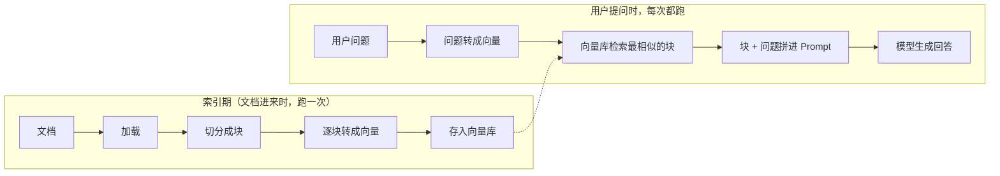

# 第 3 章 给模型补上知识：RAG 与检索增强实战

> 一句话总结：从「模型不知道我的私有文档」这个问题出发，理解 Embedding 与向量检索，建成一条能对本地文档问答的 RAG 链。

## 从一个让人尴尬的问题开始

把第 2 章的链搭好后，你兴冲冲地问模型：「我们公司的报销审批流程是什么？」模型面不改色地编了一套看起来很专业的流程。它答得那么自信，你差点就信了。

这就是本章要解决的两个现实：

- **知识截止**：模型训练完那一刻之后的、以及训练时没见过的内容，它不知道。你的公司文档、你的产品手册、你昨天的会议纪要，都在这个范围里。
- **幻觉（Hallucination）**：不知道不等于会承认。模型倾向于生成「看起来合理」的回答，而不是说「我不知道」。编造得一本正经，比直接报错危险得多。

直觉解法是把文档塞进 Prompt。马上撞上第 1 章讲的上下文窗口：一份几百页的手册塞不下，硬塞就截断；就算塞得下，每次问答都带着整本手册跑，token 账单会教你做人。

真正可行的思路是：**不问全文，先找到和问题最相关的几段，只把这几段连同问题一起发给模型**。这个思路叫 RAG（Retrieval-Augmented Generation，检索增强生成）——检索来增强生成。

## RAG 的两条流水线

RAG 系统由两条在不同时间运行的流水线组成：



索引期把文档加工成「可按语义查找」的形态，查询期用问题去匹配最相关的内容。两条线通过一个东西咬合：**向量**。

## 术语地基：Embedding、向量与相似度

**Embedding（嵌入）** 是把一段文字变成一串数字（向量）的技术。这串数字不是随机编的：语义相近的文字，向量也相近。「报销流程怎么走」和「费用审批的步骤」字面完全不同，但向量距离很近；「今天天气不错」和它们离得很远。

你可以把它想象成给每段文字在一张巨大的语义地图上标注坐标。坐标本身人看不懂（常见的是几百到几千维），但机器算「两个坐标离多远」又快又准。

看个玩具级的例子感受下。假设向量只有三维（真实的是几百上千维），三句话的坐标可能是：

```text
"报销流程怎么走"   → [0.82, 0.55, 0.08]
"费用审批的步骤"   → [0.79, 0.58, 0.11]
"今天天气不错"     → [0.02, 0.10, 0.95]
```

前两句字面没有一个字相同，但三个维度上的数值都很接近——语义近，坐标就近。第三句和前两句格格不入。检索时算的就是这个「接近程度」。**相似度（Similarity）** 最常用的度量是余弦相似度：把向量看成从原点出发的箭头，比较箭头方向的夹角，方向越一致越相似，取值在 -1 到 1 之间，接近 1 就是「说的是一回事」。用方向而不是绝对距离，是为了让「短文」和「长文」也能公平比较。

Embedding 模型就是负责算坐标的模型。它不做生成，输入一段文字，输出一串数字。这带来一个供应商层面的现实：**生成模型和 Embedding 模型是两种模型**，各家提供情况不同。截至 2026-07 核验，DeepSeek 没有提供 Embedding API，所以本章的向量环节用 OpenAI 的 `text-embedding-3-small`（便宜量足），生成环节继续用 DeepSeek。一个系统里混用多家供应商是常态，LangChain 的统一接口让这种混用没有额外负担。

也要知道语义检索的边界：它擅长「意思相近」，不擅长「字面精确」。问「第 3.2 条规定了什么」这种带编号、代号、专有名词的问题，纯向量检索可能不如关键词匹配靠谱。工业界的做法是两者混用（叫混合检索），本章不展开，知道有这么个方向就行。

**向量数据库（Vector Store）** 是存向量并支持相似度检索的存储。生产上常用专用的（如 pgvector、Milvus、Qdrant），学习和原型阶段用内存版就够。本章用的 `MemoryVectorStore` 不依赖任何外部服务，跑完进程就没了，正适合练手。

## 动手第一步：加载与切分

准备一份实验文档。新建 `refund-policy.md`，写一段你编的「公司报销制度」，三百字以上，包含几条具体规则。如果你懒得编，直接抄这份：

```text
# 公司费用报销制度（示例）

一、基本规则
员工因公发生的费用，应在费用发生后 30 天内提交报销申请，逾期不予受理。
报销需提供正规发票，发票抬头必须为公司全称，个人抬头的发票不予报销。

二、审批权限
单笔金额 500 元以下（含）由直属主管审批；
500 元至 5000 元（含）由部门负责人审批；
超过 5000 元的，需分管总监审批，并附费用说明。

三、差旅费用
出差需提前在 OA 系统提交出差申请，未经批准的出差费用不予报销。
住宿标准：一线城市每晚不超过 500 元，其他城市每晚不超过 350 元。

四、打款时间
审批通过后的报销款，于次月 10 日前随工资一并发放。
```

内容随意，但要有点细节，后面问答用得上。

加载进程序：

```ts
import { readFile } from "node:fs/promises";
import { Document } from "@langchain/core/documents";

const text = await readFile("refund-policy.md", "utf8");
const doc = new Document({
  pageContent: text,
  metadata: { source: "refund-policy.md" },
});
```

`Document` 是 LangChain 里文档的标准容器：`pageContent` 是正文，`metadata` 是随文档携带的信息（来源、页码、作者）。metadata 现在看着多余，等检索结果出来你想知道「这段出自哪个文件」时，就离不开它了。

文档多的话，不必都像这样手动读文件。社区有现成的加载器（Loader）：PDF 用 `PDFLoader`、网页用 `CheerioWebBaseLoader`、Markdown 目录有批量加载器，用法清一色是 `load()` 之后拿到 `Document[]`。不管什么格式，出来的都是同一个标准容器，下游的切分、入库代码一行不用改。这又是一个「统一接口」的例子：加载器把格式的差异挡在了门外。涉及扫描版 PDF（图片型）时文本抽取会是空的，那种要先做 OCR，不在本课范围。

### 为什么要切分

直接把整篇文档转成向量，效果很差：一篇讲十条制度的文档变成一个向量，语义被平均掉了，问哪条都匹配不准。所以要切成小块（chunk），每块聚焦一小段内容。

用 `RecursiveCharacterTextSplitter`，它按「段落 → 句子 → 字符」的优先级递归切，尽量不切碎句子：

```ts
import { RecursiveCharacterTextSplitter } from "@langchain/textsplitters";

const splitter = new RecursiveCharacterTextSplitter({
  chunkSize: 200,     // 每块目标长度（字符数）
  chunkOverlap: 40,   // 相邻块之间重叠的字符数
});

const chunks = await splitter.splitDocuments([doc]);
console.log(chunks.length);            // 看切成了几块
console.log(chunks[0].pageContent);    // 看第一块长什么样
```

用上面那份示例文档、`chunkSize: 200`，切出来大约 3 到 4 块。第一块大概长这样：

```text
# 公司费用报销制度（示例）

一、基本规则
员工因公发生的费用，应在费用发生后 30 天内提交报销申请，逾期不予受理。
报销需提供正规发票，发票抬头必须为公司全称，个人抬头的发票不予报销。
```

注意它停在了「审批权限」之前——切分器尽量在段落边界下刀，而不是在句子中间拦腰砍断。这就是 Recursive 的意义。

两个参数值得说清楚。`chunkSize` 是权衡点：块太大，语义平均化，检索不准；块太小，上下文不完整，模型拿到半句话没法回答。`chunkOverlap` 是为了缓解「答案刚好横跨两块边界」的问题，重叠让边界附近的内容在两块里都出现。没有放之四海皆准的数值，本章后面有个实验专门感受它。

## 动手第二步：向量化与入库

把每个块转成向量，存进向量库：

```ts
import { OpenAIEmbeddings } from "@langchain/openai";
import { MemoryVectorStore } from "@langchain/classic/vectorstores/memory";

const embeddings = new OpenAIEmbeddings({ model: "text-embedding-3-small" });

// fromDocuments：逐块算向量，连同原文和 metadata 一起入库
const vectorStore = await MemoryVectorStore.fromDocuments(chunks, embeddings);
```

`fromDocuments` 一次性做完「逐块 Embedding + 入库」。注意入库的不只是向量，原文和 metadata 也在一起：检索的目的是拿回原文，向量只是查找用的索引。

## 动手第三步：检索器接进链

向量库有一个 `asRetriever` 方法，把自己变成一个 Runnable——没错，检索器也是水管，可以直接 pipe：

```ts
const retriever = vectorStore.asRetriever(3); // 每次检索返回最相似的 3 块

const hits = await retriever.invoke("超过多少钱要总监审批？");
console.log(hits[0].pageContent);  // 最相关的那块原文
console.log(hits[0].metadata);     // { source: "refund-policy.md" }
```

到这一步，先别急着接模型。单独测试检索质量是 RAG 调试的基本功：拿几个预期能命中的问题试试，如果检索出来的块根本不对，接再好的模型也白搭。**检索对了，生成才有的聊。**

## 动手第四步：完整的 RAG 链

回忆第 2 章的 `RunnableParallel`：一条分支拿检索结果，一条分支保留问题，汇合进模板：

```ts
import { ChatOpenAI } from "@langchain/openai";
import { ChatPromptTemplate } from "@langchain/core/prompts";
import { StringOutputParser } from "@langchain/core/output_parsers";
import { RunnableParallel, RunnablePassthrough } from "@langchain/core/runnables";

const model = new ChatOpenAI({
  model: "deepseek-v4-flash",
  apiKey: process.env.DEEPSEEK_API_KEY,
  configuration: { baseURL: "https://api.deepseek.com" },
  temperature: 0,  // 按文档回答，不要发挥
});

const prompt = ChatPromptTemplate.fromMessages([
  ["system", `你是公司制度问答助手。只根据【资料】回答，资料里没有的就说"制度文档中没有找到相关规定"。
【资料】
{context}`],
  ["human", "{question}"],
]);

const chain = RunnableParallel.from({
  context: retriever.pipe(new RunnableLambda({
    func: (docs) => docs.map((d) => d.pageContent).join("\n---\n"),
  })),
  question: new RunnablePassthrough(),
})
  .pipe(prompt)
  .pipe(model)
  .pipe(new StringOutputParser());

const answer = await chain.invoke("超过多少钱要总监审批？");
console.log(answer);
```

如果一切正常，你会看到类似这样的回答：

```text
根据制度文档，单笔报销金额超过 5000 元的，需分管总监审批，并附费用说明。
```

对照原文「二、审批权限」那段——模型没有发明任何东西，答案是从检索到的块里来的。再问一个文档里没有的，比如「团建费用谁出」，应该看到「制度文档中没有找到相关规定」，而不是一段编造的制度。这两个回答一个验证「答得准」，一个验证「不乱说」，缺一不可。

（`RunnableLambda` 的 import 在 `retriever.pipe(...)` 之前，记得从 `@langchain/core/runnables` 引入。）

这条链值得逐环节读一遍：问题进来后同时走两条路——检索分支拿回三块原文拼成一段文本，直通分支保留问题本身；两者在模板处汇合，拼成完整 Prompt 发给模型；最后剥成字符串。整条链没有一个环节是「RAG 专用魔法」，全是第 2 章的部件在组合。

注意 system 指令里那句「资料里没有的就明说」。这是用 Prompt 对抗幻觉的基本动作：不给模型自由发挥的空间，它的回答就被锚定在检索到的资料上。`temperature: 0` 是同一个意图。

## 观察实验：chunkSize 怎么影响答案质量

RAG 的参数不是玄学，做个实验感受一下。固定同一个问题，分别用两组切分参数重建索引再问答：

| 实验 | chunkSize / overlap | 观察点 |
| --- | --- | --- |
| A | 100 / 20 | 块多而碎，检索命中率高，但单块可能缺上下文，答案容易只答一半 |
| B | 200 / 40 | 基准组 |
| C | 800 / 100 | 块少而大，语义被稀释，可能检索不到该中的块，或者检索到了但夹带大量无关内容干扰回答 |

实验方法：把切分之后的代码包成函数，参数化 `chunkSize`，对同一个问题跑三次，人工对比答案的完整度和准确度。再加一个观察维度：打印每次检索命中的块，看看三组参数下「检索结果」本身有什么变化——很多时候答案变差，根子在检索，不在生成。

这个实验没有标准答案，你的文档、你的问题都会改变最优值。要带走的是方法：**RAG 调参先调检索，检索用命中块的肉眼检查来评估，别直接拿最终答案碰运气。**

## RAG 出问题时，按这个顺序排查

RAG 系统出毛病，新手容易直接怀疑模型不行。实际上问题分布是有规律的，按出现频率从高到低排，排查顺序应该是：

1. **检索环节**：打印命中的块。块不对，后面全白搭。块不对就先查切分（是不是切碎了关键句、是不是块太大稀释了语义），再查问题表述（用户的问题和文档的用词差太远时，可以先让模型把问题改写成更贴近文档措辞的形式再检索，这是常见的改进手段）。
2. **拼装环节**：打印最终 Prompt。检索对了但 Prompt 里没拼进去、拼错了变量名、或者 system 指令和资料打架（比如指令说「简明回答」，资料却是需要逐条引用的清单），都是这个环节的常见病。第 2 章的 `RunnableLambda` 打印大法在这里依然好使。
3. **生成环节**：前两步都没问题，答案还是不行，才轮到模型。换更强的模型、调 temperature、改指令措辞。

养成「先打印中间产物，再怀疑下游」的习惯，RAG 的调试就是体力活而不是玄学。

## 让回答带上出处

真实的问答产品里，光答对还不够，用户想知道「这话哪来的」。利用一直跟着文档块走的 metadata，改造 `context` 分支，把来源一起拼进去：

```ts
const chain = RunnableParallel.from({
  context: retriever.pipe(new RunnableLambda({
    func: (docs) =>
      docs
        .map((d, i) => `【资料${i + 1}】（来源：${d.metadata.source}）\n${d.pageContent}`)
        .join("\n\n"),
  })),
  question: new RunnablePassthrough(),
})
  .pipe(prompt)
  .pipe(model)
  .pipe(new StringOutputParser());
```

再把 system 指令补一句「回答末尾注明依据的资料来源」，模型的回答就会带上文件名。metadata 的设计价值在这里兑现了：它不参与向量计算，但贯穿检索全程，是业务信息回流的通道。以后接真实系统时，你可以往里放页码、更新时间、权限标签——权限标签甚至能在检索后过滤掉当前用户无权查看的块，这是企业 RAG 的常见需求。

## 常见误区

**误区一：RAG 就是微调。** 两回事。RAG 不改模型，只是运行时把资料递到它眼前；微调（Fine-tuning）是用数据继续训练，改变模型本身。想灌知识用 RAG，想改风格、改行为模式才考虑微调。RAG 便宜、可随时更新资料、能标注出处，是知识型问答的默认起点。

**误区二：检索到了就等于答得对。** 检索只保证「相关内容送到了模型眼前」，模型仍可能读漏、理解错、或者在你的资料自相矛盾时选错一边。对准确率要求高的场景，还要加回答后的校验环节（第 2 章的结构化输出是一种手段，实战模块里还会看到更多）。

**误区三：向量库越高级，效果越好。** 原型阶段的瓶颈几乎都在切分策略和 Prompt 上，不在向量库选型上。`MemoryVectorStore` 足够你验证整个思路，数据量大了再迁移到专用向量库，检索接口是一样的。

## 动手练习

1. 把你自己的一份真实笔记（周报、读书笔记都行）建成问答链，问它三个「答案确实在笔记里」的问题和一个「不在笔记里」的问题，观察幻觉是否被 system 指令压住。
2. 把 `asRetriever(3)` 改成 `asRetriever(1)` 和 `asRetriever(6)`，对比回答变化，想想为什么不是越多越好。
3. 在 `context` 分支里把 metadata 也拼进 Prompt（比如注明「以下资料来自 xxx 文件」），让模型在回答里说明出处。

## 收口：做成一个能聊起来的命令行问答

到目前为止的代码都是「问一次就退出」。把它包成一个循环，你就得到了一个真正能用的小工具——对本地文档的问答机器人：

```ts
import { createInterface } from "node:readline/promises";

// 前面建好的 chain 原样复用，外面包一个交互循环
const rl = createInterface({ input: process.stdin, output: process.stdout });
console.log("报销制度问答机器人上线了，输入 exit 退出。");

while (true) {
  const question = await rl.question("\n你问：");
  if (question.trim() === "exit") break;
  if (!question.trim()) continue;

  const answer = await chain.invoke(question);
  console.log("答：", answer);
}
rl.close();
```

`readline` 是 Node 自带的交互式输入模块，`await rl.question(...)` 等用户敲一行。整个机器人没有新增任何 LangChain 知识——链建好之后，它就是一个普通函数，输入字符串输出字符串，想包在什么壳里都行：命令行、HTTP 接口、Slack 机器人。模块三会把它包进一个真正的 Web 应用。

顺手再练一个工程动作：现在索引是每次启动重建的。文档多时，每次启动都重算 Embedding 又慢又费钱。想想怎么把「建索引」和「问答」拆成两个脚本——前者把向量结果序列化存盘，后者启动时加载。这正是生产 RAG 系统「索引服务」和「查询服务」分离的雏形。

## 小结

本章从「模型不知道私有知识还硬答」出发，走完了 RAG 的完整链路：索引期加载、切分、向量化、入库，查询期检索、拼装、生成。核心认知有三个：Embedding 让语义可以计算；检索质量决定回答上限，调参先调检索；RAG 链没有新魔法，全是 Runnable 的组合。

到这儿，模型的「说」和「知」都有了。下一章给它「做」的能力：调用工具，自己决定下一步——Agent 登场，也是 LangChain 能力边界的试金石。

## 自测

1. 索引期和查询期分别做什么？为什么说向量是两条流水线的咬合点？
2. `chunkOverlap` 解决的是什么问题？把它设为 0 可能在什么情况下出岔子？
3. 为什么 DeepSeek 在本章只负责生成、不负责向量化？
4. 「检索结果不对就换更大的生成模型」这个调试思路错在哪？

参考答案：1. 索引期把文档加工成向量入库，查询期用问题向量检索相关块并生成回答；同一套 Embedding 让问题和文档块在同一语义空间里可比较。2. 缓解答案横跨切块边界导致的上下文断裂；设为 0 时，刚好被切开的句子在两块里都只剩半截，检索到哪块都答不完整。3. 截至 2026-07 核验，DeepSeek 没有提供 Embedding API。4. 检索错意味着模型根本没看到正确资料，换再大的生成模型也是在错误资料上作答；应先检查切分和检索。
