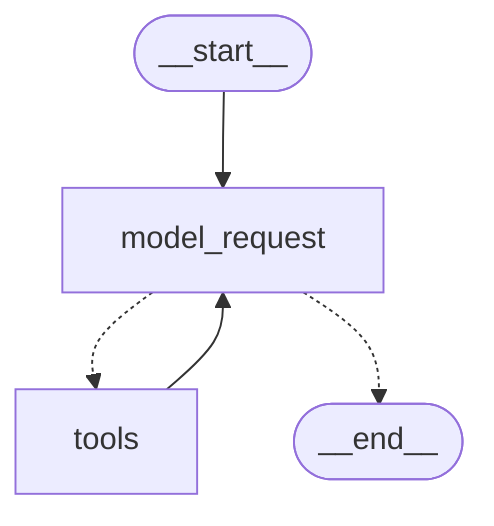
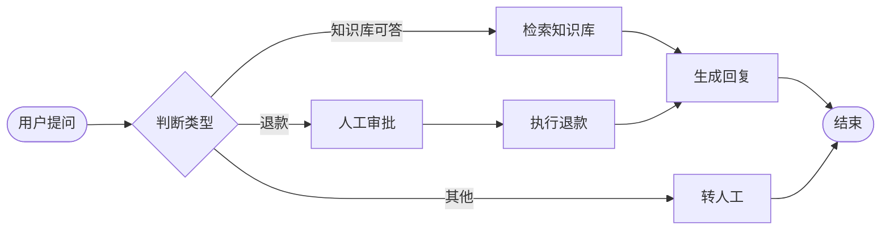

# 第 5 章 LangGraph 是什么：从链到图的必然

> 一句话总结：把第 4 章手写的 Agent 循环抽象成状态、节点、边三要素，理解图编排的设计动机，以及 LangChain 与 LangGraph 的真实分工。

## 从第 4 章那 30 行代码说起

第 4 章你手写过一个 Agent 循环，核心长这样：

```ts
for (let step = 0; step < 8; step++) {
  const ai = await modelWithTools.invoke(messages);  // 调模型
  messages.push(ai);
  if (!ai.tool_calls?.length) return ai.content;      // 判断：要不要继续
  for (const call of ai.tool_calls) {
    const result = await tools[call.name].invoke(call.args);  // 执行工具
    messages.push(new ToolMessage({ content: String(result), tool_call_id: call.id }));
  }
}
```

当时我们说「整个 Agent 就是一个 for 循环加一个判断」。现在把这堆过程式代码摊平了看，它其实在做三类事情：

- 有几段**各自独立的动作**：调模型、执行工具。每段动作读当前的消息数组，干完活，往数组里追加内容。
- 有一个**共享的数据载体**：`messages` 数组。所有动作都读它、写它，它是全场唯一的状态。
- 有一套**流转规则**：模型之后，要么结束，要么去工具；工具之后，一定回模型。谁决定往哪走？数据本身（有没有 tool_calls）。

动作、状态、流转规则。把这三样东西从 for 循环里抽出来，给它们正式的名字，你就得到了 LangGraph 的全部核心概念。

## 三要素：State、Node、Edge

**State（状态）**：全场共享的数据载体。上手写版里是 `messages` 数组；在 LangGraph 里它是一个明确定义结构的对象，你想放什么都行——消息、计数器、检索结果、审批标记。每个动作结束后，不直接改 State，而是**返回「我要更新哪些字段」**，由框架按规则合并进 State。这个「返回增量而不是直接改」的约定，是后面持久化、回放、并行都成立的基础，第 6 章细讲。

**Node（节点）**：各自独立的动作。一个节点就是一个函数，输入是当前 State，输出是对 State 的增量更新。调模型是一个节点，执行工具是一个节点，查数据库、调审批、做格式转换，都可以是节点。

**Edge（边）**：节点之间的流转规则。「模型节点结束后去工具节点」是一条边；「根据 State 里有没有 tool_calls 决定去工具还是去终点」是一种带判断的边，叫**条件边**。

对照一下，手写版的 for 循环翻译成三要素就是：

| 手写版 | LangGraph |
| --- | --- |
| `messages` 数组 | State 里的 messages 字段 |
| `modelWithTools.invoke(...)` | 「模型」节点 |
| `tools[call.name].invoke(...)` | 「工具」节点 |
| `if (!ai.tool_calls?.length) return` | 模型节点出发的条件边 |
| `for` 循环本身 | 节点互指形成的循环结构 |

## 术语地基：图、状态机、循环图

三个概念一次说清，都是计算机科学的词，但这里只需要常识级理解。

**有向图（Directed Graph）**：一堆点加上一堆带箭头的线。点是节点，线是边，箭头表示「执行完我，接下来去你」。流程图就是有向图，你早就会画了。

**状态机（State Machine）**：一种思考问题的方式——系统任何时候都处于某个状态，发生某件事就转移到另一个状态。电梯就是状态机：在「待机」状态收到「按了 5 楼」，转移到「上行」。LangGraph 的每次执行都可以这样看：State 是系统状态，节点是引起转移的事件。

**循环图 vs DAG**：DAG（有向无环图）是「不能绕回去」的图，执行路径像瀑布，一泻到底。LCEL 链就是 DAG——模板到模型到解析器，永不回头。Agent 必须能绕回去：模型 → 工具 → 模型 → 工具……直到收工。这种「能绕圈」的图叫循环图（Cyclic Graph）。**支持循环，是 LangGraph 与 LCEL 最本质的分界线**：第 4 章的循环靠你手写 for 实现，LangGraph 把它变成图的原生结构，由框架负责推进和兜底。

## 诞生背景：LangChain 自己长出来的答案

LangGraph 不是另一个团队的竞品，它是 LangChain 团队自己的作品。搞清楚它为什么被造出来，本模块的学习目标就清楚了一半。

2023 年 LangChain 爆红之后，社区用它做 Agent 的热情高涨，但抱怨也越来越集中：Chain 是直线，Agent 要绕圈；当时的 Agent 实现（`AgentExecutor` 等）把循环、解析、错误处理揉在一起，行为像个黑盒——模型在中间某步做了奇怪的决定，你很难干预，也很难让流程在特定位置停下来等人。开发者想要的是「自己掌控循环的每一环」，而不是「参数更多的黑盒」。

2024 年初，LangGraph 作为回答发布：不提供「更大的 Agent」，而是提供一套描述**任意**流程的底层结构——图。Agent 循环只是图上的一种特定形状，你可以画出任何别的形状。它的底层执行借鉴了 Google 2010 年提出的 Pregel 图计算模型（下文会讲到），这在当时是做 LLM 编排的框架里独一份的设计。

2025 年 10 月，LangGraph 与 LangChain 同步发布 v1：LangChain 的 Agent 能力（`createAgent`）直接建立在 LangGraph 之上，旧的黑盒 Agent API 全部退场。这个架构决定很说明问题——**图成了地基，Agent 成了地基上的一种预制建筑**。你学 LangGraph 不是在学一个备选工具，是在学 LangChain 系产品的底层。

## 为什么要把循环从代码变成图

有人会问：for 循环写得挺好，为什么非要抽象成图？第 4 章末尾的四个场景已经给了一半答案，这里把它说透。

**第一，流程要能被看见。** for 循环的流程藏在代码逻辑里，新人要读完全部代码才能在脑子里重建它。图是显式的：节点和边的定义摆在那，甚至可以导出成一张可视化流程图。流程即文档。

**第二，状态要能被管理。** 手写版的消息数组是私有变量，进程死了就没了。图框架把 State 当成一等公民：每一步执行完，框架都知道 State 变成了什么样，可以存下来（第 8 章的持久化）、可以回放历史（第 8 章的快照）、可以从中途恢复（第 9 章的中断续跑）。这些能力如果手写，每一项都是一个大工程。

**第三，暂停和恢复要成为可能。** for 循环跑到一半想停下来等人审批，你得把循环拆成「前半段」和「后半段」，中间状态手动存取，代码立刻臃肿。图框架知道「执行到哪个节点了」，暂停就是记住位置，恢复就是从位置继续，这是第 9 章的主题。

**第四，多人（多 Agent）协作要有结构。** 循环套循环的代码没人看得懂，但「调度节点根据情况分发给不同专业节点」在图里是自然表达，第 10 章见。

一句话：for 循环能表达 Agent 的**逻辑**，但表达不了 Agent 的**工程需求**。LangGraph 把循环结构化的同时，顺带解决了状态、暂停、协作三个工程问题。

## LangGraph 与 LangChain 的关系

第 4 章的对比表给过结论：LangChain 管零件，LangGraph 管流程。这里补几个你没问但会踩的细节。

**技术上，LangGraph 不依赖 LangChain 的部件，但它们配合最顺手。** 节点函数是普通的 async 函数，你在里面可以裸调模型 API，也可以用 ChatModel、LCEL 链、`createAgent` 造好的 Agent。实践中，节点内部几乎总是 LangChain 部件——这也是为什么模块一在前。

**`createAgent` 本身就是 LangGraph 建的。** 第 4 章用的 `createAgent`，内部就是一张「模型节点 + 工具节点 + 条件边」的图。你从第 4 章起就在用 LangGraph 了，只是框架替你画了图。学完本模块，你可以自己画出比它复杂得多的图。

眼见为实。`createAgent` 造出来的 agent 可以直接导出内部结构（2026-07-27 在 v1.5.4 上实测）：

```ts
const agent = createAgent({ model, tools: [add] });
console.log(await agent.drawMermaid());
```

打印出来的 Mermaid 源码渲染后就是这张图：



看它的形状：起点进 `model_request`（模型节点），模型之后条件分叉——去 `tools`（工具节点）或去终点，工具之后回到模型。**和第 4 章手写的循环一模一样，连「工具完事回模型」的回边都在。** 下一章你会亲手画出这张图，到时候对照着看。

**执行模型有个名字，叫 Pregel。** LangGraph 的底层执行借鉴了 Google 的 Pregel 图计算模型。直觉版理解（不需要深究）：图的执行按「步」推进，每一步里，所有「该执行」的节点并行跑完，框架统一收集它们的增量更新合并进 State，然后看边决定下一步谁执行。记住「按步推进、统一合并」这八个字，第 7 章并行分支、第 8 章快照语义都会用到。

**生态里还有两个名字会碰到。** LangGraph Studio 是官方的可视化调试工具，能把运行中的图画出来、单步执行、检查每一步的 State；LangGraph Platform 是托管部署方案，把图变成可调用的服务。第 10 章讲生产化时会给出「什么时候需要它们」的判断标准，现在知道名字就够。

**什么时候不要上 LangGraph。** 直线流程（第 2、3 章的链）用它纯属杀鸡用牛刀；单个 Agent 循环用 `createAgent` 已经够。上 LangGraph 的信号是第 4 章那四个场景：确定性分支、跨轮持久状态、人工介入、多 Agent 协作。

## 场景判断练习：链、Agent 还是图

学框架最怕的是手里有了锤子，看什么都像钉子。下面六个场景，先自己判断该用哪层工具，再对照答案：

| 场景 | 你的判断 | 参考答案 |
| --- | --- | --- |
| 把用户输入翻译成英文并输出 JSON | ？ | LCEL 链。步骤固定，一次调用的事 |
| 问答机器人，要先检索文档再回答 | ？ | LCEL 链。检索→生成是确定的直线 |
| 助手能查天气、算汇率，自己决定用哪个 | ？ | createAgent。需要自主选工具，但流程就是标准循环 |
| 客服系统：简单问题自动答，投诉必转人工 | ？ | LangGraph。分支规则是业务规则，不能交给模型自由发挥 |
| 代码审查 Agent，每处高危修改要人确认 | ？ | LangGraph。人工介入是图的 interrupt 原生能力 |
| 调研助手：一个查资料、一个写稿、一个审校 | ？ | LangGraph。多 Agent 协作需要结构化的状态与交接 |

规律很清楚：**流程的确定性越强，越该用简单的工具；流程的拓扑越复杂，越需要图。** 判断错方向的代价是真实的：该用链的上了图，代码量翻倍还没好处；该用图的用链硬拧，维护到怀疑人生。

## 把业务流程画成图：一个思维练习

写代码之前，先练「翻译」：把文字描述的业务流程翻译成节点和边。这是用 LangGraph 解决问题的第一步，也是最容易被跳过的一步。

拿「客服工单处理」练手（这正是模块三项目的雏形）：

> 用户提出问题后，系统先判断问题类型：能用知识库回答的，检索后直接回复；涉及退款的，必须先经人工审批，批准后才能执行退款并回复；其他类型转人工客服。

试着拆解。节点有哪些？「判断类型」「检索知识库」「生成回复」「人工审批」「执行退款」「转人工」。State 里该放什么？用户问题、问题类型、检索结果、审批结果、最终回复。边怎么连？起点进「判断类型」，然后条件边分三路：知识库路去「检索」，退款路去「人工审批」再到「执行退款」，其他去「转人工」，最后都汇入「生成回复」或直接结束。

画在纸上就是这样（画不出来也没关系，下一章开始用代码画）：



注意三个地方：「判断类型」后面是条件边，一个节点分出多路；「人工审批」是个会暂停等人的节点，第 9 章你就学到它的实现；多条路在「生成回复」合流，这种「分而复合」的结构第 7 章会专门练。

## 本模块路线图

接下来五章这样走：

- **第 6 章**：State、Node、Edge 上手，跑通第一张图，搞懂 Reducer。
- **第 7 章**：条件边与循环，用图重写第 4 章的 Agent，加上并行分支。
- **第 8 章**：Checkpointer 持久化，让图能记忆、能回放、能断点续跑。
- **第 9 章**：interrupt 人工介入 + 三种粒度的流式输出。
- **第 10 章**：多 Agent、子图、LangSmith 观测与部署决策。

每章都在前一章的图上加东西，到最后你会拥有一套完整的、能上线的 Agent 工作流技术栈。

## 小结

本章没有写一行 LangGraph 代码，但完成了最重要的认知转换：把手写 Agent 循环拆成状态、节点、边三要素；明确了「支持循环」是图与链的本质分界；说清了为什么工程需求（看得见、管得住、停得下、协作得了）逼着我们把循环从代码变成图。LangChain 与 LangGraph 不是二选一，而是「零件」与「图纸」的关系，`createAgent` 就是两者结合的现成证据。

下一章开始写代码：第一张图，两个节点，跑通它。

## 自测

1. 手写 Agent 循环里的 `messages` 数组、模型调用、工具执行、`if` 判断，分别对应 LangGraph 的什么概念？
2. LCEL 链和 Agent 循环在图的形态上有什么本质区别？
3. 节点函数为什么不直接修改 State，而是返回增量？
4. 「`createAgent` 内部就是一张 LangGraph 图」这个事实，对理解两个框架的关系有什么启发？

参考答案：1. State、模型节点、工具节点、条件边。2. LCEL 链是 DAG（无环，一泻到底），Agent 循环是循环图（模型与工具互指，可绕圈）。3. 增量约定让框架统一掌握每次状态变化，持久化、历史回放、并行合并才有了基础。4. 两框架是上下层而非竞争关系：LangGraph 提供编排骨架，LangChain 部件填充节点内部，简单场景用现成封装，复杂场景自己画图。
