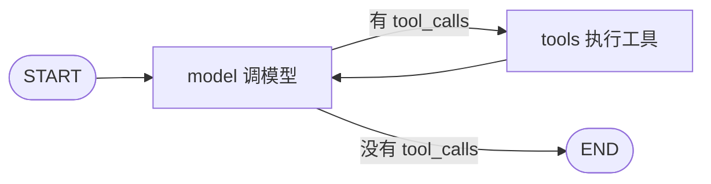

# 第 7 章 分支与循环：条件边让图活起来

> 一句话总结：用条件边表达「根据状态决定去向」，用节点互指表达循环，亲手用 LangGraph 重建第 4 章的 Agent，并掌握并行分支的写法与死循环防护。

## 本章要解决的问题

第 6 章的图是一根直线：START → step1 → step2 → END。真实流程从来不是直线。本章回答两个问题：流程要根据中间结果走不同路径，怎么写？流程要反复执行直到满足条件，怎么写？学完后，第 4 章手写的 Agent 循环会被我们用图重新实现一遍——而且结构更清楚。

## 条件边：把 if 从节点里请出来

第 6 章的 `addEdge("a", "b")` 是固定边：a 执行完必去 b。条件边不同：a 执行完去哪，由一个**路由函数**看着当前 State 决定。

```ts
import { StateGraph, Annotation, START, END } from "@langchain/langgraph";

const State = Annotation.Root({
  score: Annotation<number>({ reducer: (_cur, update) => update, default: () => 0 }),
  verdict: Annotation<string>({ reducer: (_cur, update) => update, default: () => "" }),
});

const grade = (state: typeof State.State) => {
  console.log("评分完成，得分:", state.score);
  return {};
};

const graph = new StateGraph(State)
  .addNode("grade", grade)
  .addNode("pass", () => ({ verdict: "及格，发证书" }))
  .addNode("fail", () => ({ verdict: "不及格，回去重修" }))
  .addEdge(START, "grade")
  .addConditionalEdges("grade", (state) => (state.score >= 60 ? "pass" : "fail"))
  .addEdge("pass", END)
  .addEdge("fail", END)
  .compile();

const out = await graph.invoke({ score: 59 });
console.log(out.verdict); // "不及格，回去重修"
```

`addConditionalEdges("grade", router)` 的意思是：grade 执行完，调用路由函数，它返回哪个节点名，就去哪个节点。路由函数是纯读 State 的判断，不写业务逻辑。

分支多的时候，可以给路由的返回值配一张映射表，可读性更好：

```ts
.addConditionalEdges(
  "grade",
  (state) => (state.score >= 90 ? "excellent" : state.score >= 60 ? "pass" : "fail"),
  { excellent: "excellentNode", pass: "passNode", fail: "failNode" }
)
```

第三个参数是「路由返回值 → 实际节点名」的对照。路由函数返回简短的标签，节点保留完整名字，各司其职。

注意一个设计取向：分数判断写在路由函数里，而不是塞进 grade 节点内部。这**不是风格洁癖**。写在条件边上，「这里有个分支」在图结构里一目了然，导出流程图也能看到岔路；藏在节点里，图就退化成了直线假象，别人（和三个月后的你）只能读代码猜流程。LangGraph 的价值观是：流转逻辑尽量显式地长在图上。

## 循环：节点互指，回到自己

把条件边的目标写成节点自己，循环就出现了：

```ts
const State = Annotation.Root({
  n: Annotation<number>({ reducer: (_cur, update) => update, default: () => 0 }),
});

const graph = new StateGraph(State)
  .addNode("inc", (state) => ({ n: state.n + 1 }))
  .addEdge(START, "inc")
  .addConditionalEdges("inc", (state) => (state.n >= 3 ? END : "inc"))
  .compile();

const out = await graph.invoke({ n: 0 });
console.log(out.n); // 3
```

执行路径：inc → inc → inc → END。每绕一圈，reducer 把 n 更新一次，路由函数重新判断一次。**循环 = 互指的边 + 每圈重新评估的条件**，图结构允许绕回去，这就是第 5 章说的循环图。

### 保险丝：recursionLimit

路由条件写错（比如写成 `state.n >= 300`），图会无限绕圈。LangGraph 有内置保险丝：默认单图最多执行 25 步，超过就抛错。步数可以在调用时调：

```ts
await graph.invoke({ n: 0 }, { recursionLimit: 100 });
```

第 4 章手写循环里的「最大步数」，在这里是框架级的标准配置。教学时可以故意造个死循环（路由永远返回 `"inc"`），跑一次看它怎么报错——错误信息里会带 recursionLimit 字样，以后在真实项目里见到它就明白是怎么回事了。

### 循环设计的三条纪律

能绕圈之后，责任也跟着来了。三条纪律：

1. **每圈必须改变状态**。循环体如果不动 State，路由条件永远不变，就是死循环。上面例子里 `n + 1` 就是那「每圈的变化」。
2. **终止条件要可达**。设计路由时先问：什么情况下停？这个情况在现实中一定能发生吗？「模型不再下工单」可达；「模型主动说完美的答案」未必可达。
3. **保险丝显式设**。生产代码把 recursionLimit 当成预算写出来，别用默认值假装它不存在。

## 实战：用图重写第 4 章的 Agent

现在干正事。第 4 章手写的循环：模型节点下工单 → 工具节点执行 → 回模型，直到不再下工单。翻译成图：



State 用现成的 MessagesAnnotation（消息天然就是状态），两个节点，一条条件边：

```ts
import { StateGraph, MessagesAnnotation, START, END } from "@langchain/langgraph";
import { ToolMessage, AIMessage } from "@langchain/core/messages";
import { ChatOpenAI } from "@langchain/openai";
import { tool } from "@langchain/core/tools";
import { z } from "zod";

// 工具还是第 4 章那个加法工具
const add = tool(async ({ a, b }) => String(a + b), {
  name: "add",
  description: "计算两个整数的和。任何加法需求都使用本工具，不要口算。",
  schema: z.object({ a: z.number(), b: z.number() }),
});
const toolsByName = { add };

const model = new ChatOpenAI({
  model: "deepseek-v4-flash",
  apiKey: process.env.DEEPSEEK_API_KEY,
  configuration: { baseURL: "https://api.deepseek.com" },
}).bindTools([add]);

// 节点 1：调模型，把它的回复（可能带工单）追加进消息
const callModel = async (state: typeof MessagesAnnotation.State) => {
  const ai = await model.invoke(state.messages);
  return { messages: [ai] };
};

// 节点 2：执行所有工单，把结果以 ToolMessage 追加进消息
const callTools = async (state: typeof MessagesAnnotation.State) => {
  const last = state.messages.at(-1) as AIMessage;
  const results = [];
  for (const call of last.tool_calls ?? []) {
    const result = await toolsByName[call.name].invoke(call.args);
    results.push(new ToolMessage({ content: String(result), tool_call_id: call.id }));
  }
  return { messages: results };
};

// 路由：最后一条 AI 消息带工单就去工具节点，否则收工
const shouldContinue = (state: typeof MessagesAnnotation.State) => {
  const last = state.messages.at(-1) as AIMessage;
  return last.tool_calls?.length ? "tools" : END;
};

const agent = new StateGraph(MessagesAnnotation)
  .addNode("model", callModel)
  .addNode("tools", callTools)
  .addEdge(START, "model")
  .addConditionalEdges("model", shouldContinue)
  .addEdge("tools", "model")   // 工具完事回模型，循环成形
  .compile();

const out = await agent.invoke(
  { messages: [{ role: "user", content: "先算 19 加 23，再加上 100，是多少？" }] },
  { recursionLimit: 12 },
);
console.log(out.messages.at(-1).content);
```

跑完把消息轨迹打出来，你会看到和第 4 章手写版一模一样的形状：

```text
[human] 先算 19 加 23，再加上 100，是多少？
[ai] tool_calls: add({"a":19,"b":23})      ← model 节点产出
[tool] 42                                   ← tools 节点产出
[ai] tool_calls: add({"a":42,"b":100})      ← 回到 model 节点
[tool] 142
[ai] 42 + 100 = 142，最终结果是 142。        ← 无工单，条件边走向 END
```

轨迹里的每一条消息都对应图上的一次节点执行——图的结构和运行的轨迹完全对得上，这就是「流程显式化」在调试时的价值。

和第 4 章的手写版逐行对照：for 循环没了，变成 `tools → model` 这条回边；`if (!tool_calls) return` 没了，变成 `shouldContinue` 路由；消息数组的维护没了，MessagesAnnotation 全包。剩下的每一行都在说业务：什么是模型节点，什么是工具节点，什么条件下继续。

这就是图的价值：**机制交给框架，意图留在代码里**。顺便说，`createAgent` 内部做的就是这张图。你自己画过一遍之后，它就不再是黑盒——你知道它的极限在哪，也知道什么时候该抛开它自己画。

## 并行分支：一次扇出，多点干活

流程不总要二选一，有时要「兵分两路，齐头并进」。比如生成报告：一路查数据，一路查历史案例，两路都完了再汇总。从同一个起点连两条边出去，就是并行：

```ts
const State = Annotation.Root({
  results: Annotation<string[]>({
    reducer: (cur, update) => [...cur, ...update],  // 数组拼接
    default: () => [],
  }),
});

const graph = new StateGraph(State)
  .addNode("fetchData", async () => {
    console.log("查数据…");
    return { results: ["数据报告"] };
  })
  .addNode("fetchCases", async () => {
    console.log("查案例…");
    return { results: ["历史案例"] };
  })
  .addNode("merge", (state) => {
    console.log("汇总，共收到:", state.results);
    return { results: [`合并了${state.results.length}份材料`] };
  })
  .addEdge(START, "fetchData")
  .addEdge(START, "fetchCases")     // 同一起点两条边：扇出
  .addEdge("fetchData", "merge")    // 两路都指向 merge：汇合
  .addEdge("fetchCases", "merge")
  .addEdge("merge", END)
  .compile();

await graph.invoke({ results: [] });
```

两个细节要懂。

**merge 会等两路都到齐才执行。** 回忆第 5 章的 Pregel 直觉：图按步推进，一步内该跑的节点并行跑完，框架统一合并增量，再推进下一步。fetchData 和 fetchCases 在同一步并行，merge 在它们都完成的下一步执行。所以你不用担心「merge 抢先跑」。

**并行写同一字段，reducer 必须扛得住。** 两路同时返回 `results` 的增量，框架按 reducer 合并。数组拼接语义下，两路的结果都保住；如果写成覆盖语义，总有一路白干。并行分支设计的第一课：**先想清楚并行节点往哪些字段写，那些字段的 reducer 能不能合并并发更新**。

## 观察实验：亲眼看看死循环防护

理论说完，动手验证一次。把循环例子的路由改成永远回到自己，步数限制设小一点：

```ts
const infinite = new StateGraph(State)
  .addNode("inc", (state) => ({ n: state.n + 1 }))
  .addEdge(START, "inc")
  .addConditionalEdges("inc", () => "inc")  // 永远绕圈
  .compile();

try {
  await infinite.invoke({ n: 0 }, { recursionLimit: 5 });
} catch (e) {
  console.log("被拦住了：", e.message);
}
```

看到报错里出现 recursionLimit，实验成功。这个实验的价值在于把「抽象的保护机制」变成「见过的具体报错」——以后线上日志里出现它，你不用查文档就知道发生了什么。

## 常见误区

**误区一：把路由逻辑塞进节点。** 「在节点里判断完直接调下一个函数」是过程式思维回潮。路由属于边，节点只管干活。判断写进节点，图结构就失去了表达能力。

**误区二：循环体不改状态。** 路由函数读的是 State，循环体不更新 State，条件永远不变，必然死循环。每圈必须有可观察的变化。

**误区三：并行分支用覆盖语义的字段。** 两个并行节点往同一个覆盖语义的字段写，结果总有一个被冲掉，而且不报错——这是最阴的一类 bug。并行写字段，一律用可合并的 reducer（数组拼接、累加、集合合并）。

## 动手练习

1. **三路分支**：把成绩图扩展成三路：90 分以上去「优秀」、60–89 去「及格」、60 以下去「重修」。判据：三组分数输入各走对路。
2. **给 Agent 加预算**：把图版 Agent 的 recursionLimit 设成 4，问它一个需要多轮工具的问题，观察保险丝触发时的报错。判据：报错含 recursionLimit，且你能解释为什么 4 步不够。
3. **并行翻译**：做一个并行图：一路把输入译成英文，一路译成日文，merge 节点把两份译文拼进同一条消息返回。判据：最终 State 里两种译文都在，没有互相覆盖。

## 小结

本章让图长出了骨架：条件边把分支逻辑显式化，节点互指让循环成为图的原生结构，recursionLimit 是绕圈的安全网；并行分支按步扇出汇合，reducer 决定并发更新怎么合并。最重要的一课是把第 4 章的手写 Agent 翻译成了图——机制归框架，意图归代码。

下一章解决「关掉进程就失忆」：Checkpointer 把图的每一步状态存下来，多轮对话、断点续跑、历史回放都靠它。

## 自测

1. 条件边和「节点内部 if 判断后调用不同函数」相比，优势在哪？
2. 循环图不死循环的两个必要条件是什么？框架提供的兜底是什么？
3. 并行分支中，merge 节点会不会在任一分支完成前执行？为什么？
4. 为什么并行写入的字段必须用可合并的 reducer？覆盖语义会造成什么后果？

参考答案：1. 分支显式存在于图结构中，可视化、可评审、可被框架感知；藏进节点则图退化为直线假象。2. 每圈改变状态且终止条件可达；兜底是 recursionLimit 步数上限。3. 不会；图按步推进，汇合节点在所有前驱完成的下一步才执行。4. 并行节点同步返回同一字段的更新，覆盖语义下后合并者冲掉先合并者，一路工作静默丢失且不报错。
