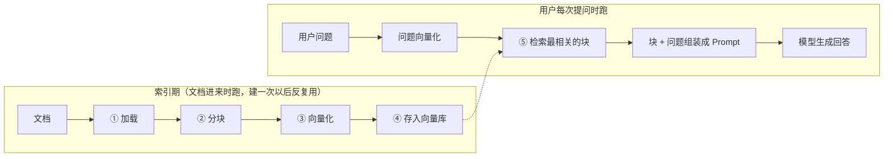

# 第 2 章 RAG 全景：索引期与查询期两条流水线

> 一句话总结：把 RAG 拆成五个核心组件、两条流水线，搭好开发环境，亲手跑通第一个端到端的最小 RAG。

## 先建立全景：一次问答背后的完整旅程

上一章我们从需求侧认识了 RAG：先查资料，再让模型基于资料回答。这一章换到工程侧，把这个思路拆成可以动手实现的零件。

任何 RAG 系统，不管是几百行代码的玩具还是大厂的生产系统，都由**两条在不同时间运行的流水线**组成：



索引期做的是「备料」：把文档加工成方便查找的形态，存起来。查询期做的是「炒菜」：用户问题来了，从备好的料里挑出最相关的，交给模型炒成答案。两条线咬合的接口是向量库——索引期写进去，查询期读出来。

## 为什么非要拆成两条

直接回答一个问题不就行了，为什么要把流程拆成两半？算一笔时间账就明白了。

假设你有一万份文档。如果不做索引，每次有人提问，系统都得现场把一万份文档挨个和问题比对一遍，一次问答几分钟，谁也等不起。而「把文档加工成可快速查找的形态」这件事，和「用户问了什么」无关，完全可以提前做、只做一次（文档有更新时增量补做）。这就是索引期存在的理由：把贵的、能提前做的工作从前端问答的关键路径上挪走。

挪走之后，查询期每次要做的只剩下：把问题也加工成同样形态，在现成的索引里快速找出相关块，组装，生成。这一步可以压到秒级。你在用任何一个知识库问答产品时感到的「即问即答」，背后都是这个分工。

这个分工还带来一个工程上的便利：文档更新不用推倒重来。新来了十份文档，只对这十份跑索引期，追加进向量库就行，原来的一万份原地不动。这叫增量索引。删除也类似，把对应向量从库里删掉，检索自然就搜不到了。第 1 章说 RAG「知识更新分钟级」，靠的就是这个性质。

## 五个核心组件，先混个脸熟

图里的每个方框都对应一个组件，后面三章会逐个深挖，现在先建立整体印象。

**① 加载（Loading）**：把各种格式的文档（Markdown、PDF、Word、网页）读进来变成纯文本。听起来简单，麻烦全在细节里：PDF 的排版会打乱阅读顺序，扫描件根本没有文本层，表格和代码块容易被拆烂。实战项目的第 13 章会专门对付它。

**② 分块（Chunking）**：把长文档切成小片段。为什么不能整篇处理，切多大合适，从哪下刀，学问很深，是第 4 章的全部内容。

**③ 向量化（Embedding）**：把每个文本块转成一串数字（向量），让「语义相近」变成「数字距离相近」。RAG 能找到「字面不同但意思相同」的内容，靠的就是它。选哪个 Embedding 模型、向量多少维，直接影响检索质量的上限。第 3 章讲透。

**④ 向量库（Vector Database）**：存向量并支持「按相似度快速查找」的存储。文档少的时候数组就行，上了规模就得靠专门的索引结构。本课用 PostgreSQL + pgvector，第 5 章从零装到用。

**⑤ 检索 + 生成（Retrieve & Generate）**：查询期的大脑。把问题向量化，去向量库要最相关的几个块，把块和问题组装成 Prompt，调模型出答案。这一步看着流程最短，其实门道最多：问题怎么理解、块取几个、Prompt 怎么组、答不上来怎么办。模块二的第 6 到 9 章，基本上就是在给这一步做各种优化。

今天的目标：用这五个组件的最简形态，手工搭一条完整链路。每个组件都先用「能跑就行」的版本，后面再一个个换成工业级版本。

## 环境搭建：先让模型能说话

### 完成标准

这一节做完，你应该在终端看到模型回复了一句话自我介绍。已经配好 Node 环境和模型 API 的同学，直接跳到「跑通第一次模型调用」核验即可。

### 核验 Node.js

本课所有示例代码是 TypeScript，跑在 Node.js 上。要求 Node.js 20 或以上。打开终端（macOS 用「终端」，Windows 用 PowerShell）：

```bash
node --version
```

看到 `v20.x.x` 或更高就过关。没装或版本太低的，去 [Node.js 官网](https://nodejs.org) 下载 LTS 版本安装，macOS 也可以用 `brew install node`。装完重开终端再验一次。npm 会随 Node 一起装好，不用单独处理。

### 初始化项目

找一个顺手的位置建课程工作目录，后面所有章节的代码都放这里：

```bash
mkdir rag-course && cd rag-course
npm init -y
```

`npm init -y` 生成一个默认的 `package.json`，它是项目的「户口本」，记录项目名字和依赖清单。然后做两件小配置。第一，把 `package.json` 里加一行 `"type": "module"`，启用 ESM 模块语法（就是 `import` / `export` 写法，本课全程用它）。第二，安装三个依赖：

```bash
npm install openai dotenv
npm install --save-dev tsx typescript
```

三个包的分工：`openai` 是 OpenAI 官方的 SDK，但因为它遵循的 OpenAI 接口协议已经是行业事实标准，智谱、DeepSeek、本地 Ollama 都兼容这套协议，所以这一个包能通吃多家供应商——这是本课「换供应商只改配置」的关键。`dotenv` 负责从 `.env` 文件读取密钥等配置，避免把密钥写死在代码里。`tsx` 让我们能直接运行 TypeScript 文件而不用先编译，学习阶段省掉一道工序。

### 拿到智谱 API Key

课程的默认可跑通示例用智谱（国内直连，有免费模型）。打开 [智谱开放平台](https://open.bigmodel.cn)，注册登录后在控制台「API Keys」页面新建一个 Key，复制下来。它长得类似 `abc123.def456` 这样的一串。

在项目根目录新建 `.env` 文件，把 Key 和三个配置写进去：

```bash
LLM_BASE_URL=https://open.bigmodel.cn/api/paas/v4
LLM_API_KEY=粘贴你的Key
LLM_MODEL=glm-4.7-flash
EMBEDDING_MODEL=embedding-3
```

四个配置的意思：`LLM_BASE_URL` 是智谱的 OpenAI 兼容接口地址；`LLM_API_KEY` 是你的身份凭证；`LLM_MODEL` 是聊天模型，glm-4.7-flash 是智谱目前的免费档型号（2026-07-28 核验，免费但有调用频率限制）；`EMBEDDING_MODEL` 是向量化模型，本章后半段就要用它。

两条安全纪律，从现在就养成：`.env` 永远不要提交进 git（在项目里建个 `.gitignore` 写上 `.env`）；Key 不要贴进代码、截图或聊天里，泄露了立刻去控制台吊销重建。

### 用别家供应商？只改配置

用 OpenAI 或本地部署的同学，代码一行不用动，改 `.env` 就行：

| 供应商 | LLM_BASE_URL | 聊天模型示例 | Embedding 模型示例 |
| --- | --- | --- | --- |
| 智谱（课程默认） | `https://open.bigmodel.cn/api/paas/v4` | `glm-4.7-flash` | `embedding-3` |
| OpenAI | 不填（SDK 默认）或官方地址 | `gpt-4o-mini` | `text-embedding-3-small` |
| 本地 Ollama | `http://localhost:11434/v1` | 本地模型名 | 本地 Embedding 模型名 |

OpenAI 的 Key 在 platform.openai.com 申请；Ollama 的本地部署方式第 3 章讲 Embedding 选型时会展开。还有一个容易踩的坑提前说：各家供应商的产品线并不对称，比如 DeepSeek 的聊天模型很强，但截至 2026-07 核验它没有提供 Embedding 接口。所以真实项目里「聊天用 A 家、Embedding 用 B 家」的混搭非常常见，本课的四个配置项分开设计，就是为了支持这种混搭。后面的正文以智谱为准，遇到差异处会提示。

### 跑通第一次模型调用

新建 `hello.ts`：

```ts
import "dotenv/config";              // 加载 .env 里的配置到 process.env
import OpenAI from "openai";

const client = new OpenAI({
  apiKey: process.env.LLM_API_KEY,
  baseURL: process.env.LLM_BASE_URL, // 指向智谱的兼容接口
});

const response = await client.chat.completions.create({
  model: process.env.LLM_MODEL!,
  messages: [{ role: "user", content: "用一句话介绍你自己" }],
});

console.log(response.choices[0].message.content);
```

运行：

```bash
npx tsx hello.ts
```

几秒后终端里出现模型的自我介绍，环境就齐了。报错了别慌，对照这张表排：

| 报错 | 可能原因 | 处理 |
| --- | --- | --- |
| 401 Unauthorized | Key 粘贴不完整、多了空格，或 Key 已吊销 | 重新复制 Key，检查 `.env` 无多余空格 |
| 429 / 1302 | 触发免费档频率限制 | 等几十秒重试；连续触发就降低调用频率 |
| 网络超时 / ENOTFOUND | baseURL 抄错，或网络代理拦截 | 对照上文表格逐字符核对 baseURL |
| `Cannot find module` | 依赖没装上，或运行目录不对 | 确认在项目根目录执行过 `npm install` |
| `process.env.LLM_MODEL` 是 undefined | `.env` 文件名不对或不在项目根目录 | 文件名必须是 `.env`，和 `package.json` 同级 |

排错时一次只改一个变量，改完重跑，这是后面所有章节的默认纪律。

到这里你的项目目录长这样，后面每章往里加文件：

```text
rag-course/
├── .env              # 密钥与供应商配置（不进 git）
├── .gitignore
├── package.json      # 含 "type": "module"
├── node_modules/
└── hello.ts          # 第一次模型调用
```

顺带解释一句 `npx tsx hello.ts` 干了什么：Node 本身只认识 JavaScript，`tsx` 这个工具在运行前把 TypeScript 实时转成 JavaScript，省去了手动编译的步骤。学习阶段用它最省事；生产项目才会走「`tsc` 编译 → 运行产物」的完整流程，实战模块会讲到。

## 最小 RAG：手写一遍全流程

环境就绪，开始搭本章的主角。我们将写大约 60 行代码，完整走一遍索引期和查询期。

先说明一个刻意的设计：本章和第 3 到 5 章，我们不用任何 RAG 框架，全部手写。市面上确实有现成框架能三行代码拼出一条 RAG 链，但框架把每个部件都封装起来之后，你就只剩「会调」，没有「懂」了。这门课的思路是反过来的：先亲手把每个部件写一遍，知道它里面是什么，以后用不用框架、用哪个框架，都是你的自由选择。

### 准备五篇小文档

新建 `rag-mini.ts`。先准备五段「公司制度」当语料，每段一两句话，覆盖不同主题：

```ts
const documents = [
  "员工因公发生的费用，应在费用发生后 30 天内提交报销申请，逾期不予受理。",
  "出差住宿标准：一线城市每晚不超过 500 元，其他城市每晚不超过 350 元。",
  "年假按工龄计算：入职满一年 5 天，满五年 10 天，满十年 15 天。",
  "加班需提前在 OA 系统申请，经直属主管批准后生效，加班费按小时工资的 1.5 倍计算。",
  "办公设备损坏应第一时间联系行政部报修，私自拆修造成的损坏由个人承担。",
];
```

真实系统里这些是从文件加载的（组件①），学习阶段直接写在代码里，把精力留给主线。

### 索引期：向量化，存进内存

接下来是组件③和④。调用 Embedding 接口，把每段文档转成向量，存进一个数组——用内存数组当「向量库」，这就是最简形态。下面是到目前为止 `rag-mini.ts` 的完整样子（`documents` 不用重复粘贴，就是刚才那五段）：

```ts
import "dotenv/config";
import OpenAI from "openai";

const client = new OpenAI({
  apiKey: process.env.LLM_API_KEY,
  baseURL: process.env.LLM_BASE_URL,
});

const documents = [
  "员工因公发生的费用，应在费用发生后 30 天内提交报销申请，逾期不予受理。",
  "出差住宿标准：一线城市每晚不超过 500 元，其他城市每晚不超过 350 元。",
  "年假按工龄计算：入职满一年 5 天，满五年 10 天，满十年 15 天。",
  "加班需提前在 OA 系统申请，经直属主管批准后生效，加班费按小时工资的 1.5 倍计算。",
  "办公设备损坏应第一时间联系行政部报修，私自拆修造成的损坏由个人承担。",
];

// 组件③：调用 Embedding 接口，把一批文本转成向量
const embedResponse = await client.embeddings.create({
  model: process.env.EMBEDDING_MODEL!,
  input: documents,
});

// 组件④：向量和原文对应着存起来（内存版向量库）
const store = embedResponse.data.map((item, i) => ({
  text: documents[i],
  vector: item.embedding,
}));

console.log(`已索引 ${store.length} 篇文档，每篇向量 ${store[0].vector.length} 维`);
```

运行到这里，每段文档已经变成了一串几百上千维的数字（智谱 embedding-3 默认 2048 维）。向量是什么、为什么能表示语义，第 3 章会讲透；现在只需要接受一个设定：**语义相近的文本，算出来的向量距离也相近**。

注意一个容易被忽略的细节：我们把五篇文档放进一个数组，一次请求就完成了全部向量化。Embedding 接口天然支持批量，一次调用处理几十上百段文本，比一段一次调用快得多，也省得频繁触发频率限制。文档量大的时候必须分批（比如每批 64 段），这个技巧第 13 章写导入流水线时会用到。

### 查询期：检索、组装、生成

查询期先要做「组件⑤的检索半段」：把问题也转成向量，然后算出它和每个文档向量的距离，取最近的几篇。算距离用余弦相似度，先把函数写出来（公式看不懂没关系，第 3 章会亲手推一遍）：

```ts
// 余弦相似度：取值 -1 到 1，越接近 1 语义越相近
function cosineSimilarity(a: number[], b: number[]): number {
  let dot = 0, normA = 0, normB = 0;
  for (let i = 0; i < a.length; i++) {
    dot += a[i] * b[i];
    normA += a[i] * a[i];
    normB += b[i] * b[i];
  }
  return dot / (Math.sqrt(normA) * Math.sqrt(normB));
}

const question = "出差住酒店一晚最多能报销多少？";

// 问题也转成向量
const qEmbed = await client.embeddings.create({
  model: process.env.EMBEDDING_MODEL!,
  input: question,
});
const qVector = qEmbed.data[0].embedding;

// 和每篇文档算相似度，按从高到低排序，取前 2 名
const ranked = store
  .map((doc) => ({ ...doc, score: cosineSimilarity(qVector, doc.vector) }))
  .sort((x, y) => y.score - x.score);

const topChunks = ranked.slice(0, 2);
topChunks.forEach((c) => console.log(`相似度 ${c.score.toFixed(3)} | ${c.text}`));
```

注意问题里没有一个字和文档原文重合——「住酒店」对「住宿」、「最多能报销多少」对「不超过 500 元」。关键词检索在这里会抓瞎，而待会你会看到，相似度排第一的大概率正是住宿标准那一条。这就是语义检索的魔力，先体验，第 3 章解释。

最后是「生成半段」：把检索到的块和问题组装成 Prompt，调聊天模型：

```ts
// 把检索结果拼进 Prompt（这就是第 1 章说的「注入知识」，只不过知识是检索来的）
const context = topChunks.map((c) => c.text).join("\n");

const answer = await client.chat.completions.create({
  model: process.env.LLM_MODEL!,
  messages: [
    {
      role: "system",
      content: "你是公司行政助手。仅根据给定资料回答问题，资料中没有的信息就说不知道。",
    },
    {
      role: "user",
      content: `【资料】\n${context}\n\n【问题】\n${question}`,
    },
  ],
});

console.log("\n回答：", answer.choices[0].message.content);
```

完整运行 `npx tsx rag-mini.ts`，你会先看到两段检索结果和它们的相似度分数，然后看到模型基于资料给出的回答，大意是「一线城市不超过 500 元，其他城市不超过 350 元」。端到端通了：加载、分块（这里一段就是一块）、向量化、存储、检索、组装、生成，一个不缺。

### 观察实验：问一个资料里没有的问题

现在做本章最重要的一个实验。把问题换成：

```ts
const question = "公司每年组织几次团建？";
```

制度五条里根本没有团建，跑一遍，观察两件事。

第一，看相似度分数。排第一的分数会明显低于上一个问题——检索器「觉得」哪条都不太相关，但它还是会交出排名前二的结果。排序组件只负责排队，不负责判断「这队里有没有能用的」。这个责任空缺，第 8 章（重排序阈值）和第 9 章（拒答策略）会补上。

第二，看模型的表现。因为我们 system 里写了「资料中没有就说不知道」，它大概率会老实拒答。你可以把那句约束删掉再跑一次，对比它会不会开始编造团建安排。这个对比能让你对「Prompt 约束」和「幻觉」的关系建立肌肉记忆。

### 再加一个实验：跨两个主题的问题

把问题再换成：

```ts
const question = "年假怎么算，加班费又是多少倍？";
```

这个问题同时涉及两条制度。跑之前先预测：检索出的前两名会是哪两条？然后跑一遍验证。你会看到年假和加班两段一起进入 Prompt，模型把两部分信息组织进同一个回答。这个实验想让你看到：TopK 取 2 不是随便定的——检索块的个数决定了模型能看到多少「证据」，取太少可能漏掉一半答案，取太多又会带进噪声。取几个、怎么取，第 8、9 章会认真讨论。

## 这个玩具和工业系统的差距

你刚刚手写的东西有个正式名字：**Naive RAG（朴素 RAG）**。它是所有 RAG 系统的原型，但和能扛真实业务的系统之间还差着一串升级，每一项都对应后面的章节：

| 玩具版的做法 | 工业版的做法 | 对应章节 |
| --- | --- | --- |
| 文档写死在代码里 | 多格式文件加载与解析 | 第 13 章 |
| 一段话就是一块 | 讲究的分块策略 | 第 4 章 |
| 内存数组存向量 | PostgreSQL + pgvector | 第 5 章 |
| 全量遍历算相似度 | ANN 索引毫秒级召回 | 第 3、5 章 |
| 用户问啥就检索啥 | 查询改写、多轮指代消解 | 第 6 章 |
| 只有向量一路检索 | 向量 + BM25 混合检索 | 第 7 章 |
| 检索到就直接用 | 重排序精排、阈值拒答 | 第 8、9 章 |
| 跑通就算完 | 用指标评估、持续迭代 | 第 10 章 |

这张表建议你收藏。后面每学完一章，回来划掉一行，进度感会非常实在。

## 小结与自测

本章你把 RAG 从概念变成了手上能跑的东西：理解了索引期和查询期为什么要分离（贵的预处理挪出问答关键路径），认识了五个核心组件（加载、分块、向量化、向量库、检索生成），搭好了 TypeScript + openai SDK + 智谱的开发环境，并手写了一条 Naive RAG 链路，还亲眼看到了它在「资料外问题」上的两种典型表现。

自测一下：

1. 索引期的四个步骤各自解决什么问题？如果把「向量化」从索引期挪到查询期（每次提问时现场给所有文档算向量），会发生什么？
2. 实验里「团建」问题的相似度分数为什么明显更低？检索器为什么还是返回了结果？
3. 删掉 system 里的拒答约束后模型可能开始编造，这说明了第 1 章哪个概念？
4. 「年假和加班费」那个实验里，如果把 TopK 从 2 改成 1，会发生什么？这暴露了 TopK 选择的什么矛盾？
5. 对照「玩具 vs 工业」对照表，你认为哪一行对答案质量的影响最大？带着你的答案往后学，学完模块二再回来看。

下一章啃最硬的一块骨头：Embedding。为什么文字变成数字就能算语义？余弦相似度到底在算什么？百万级数据怎么做到毫秒检索？搞懂这些，你才算真正摸到了 RAG 的命门。
