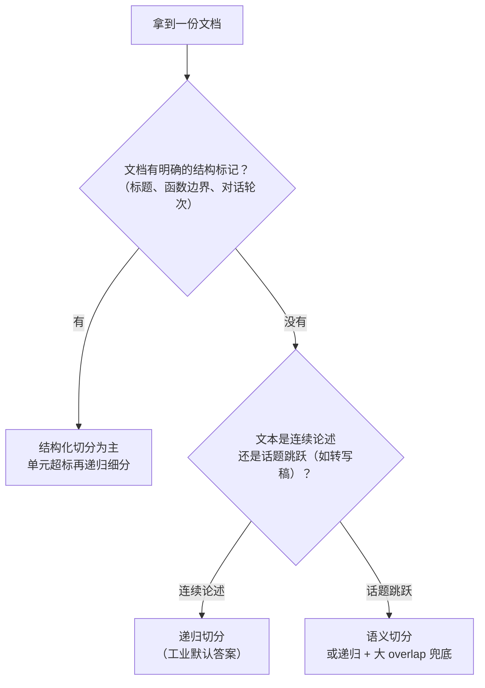

# 第 4 章 文本分块 Chunking：切得好才能搜得准

> 一句话总结：搞懂为什么分块直接决定检索质量，掌握固定、递归、结构化、语义四种切分策略与 Chunk Size、Overlap 的权衡方法。

## 从一个「明明有却搜不到」的案例开始

有人拿自己两千行的运维手册做 RAG，把整篇手册算成一个向量入库。然后问「Nginx 配置怎么改」，没搜到；问「数据库连接池满了怎么办」，还是没搜到。手册里白纸黑字写着答案，检索就是找不着。

第 3 章已经讲过了病根：语义稀释。两千行手册讲了五十件事，一个向量装不下，五十层语义平均成一个坐标，这个坐标对哪件事都不够近。再加上 Embedding 模型的输入上限，超长部分可能压根没参与计算。

所以分块（Chunking）不是可选项，是索引期的标准动作。这一章要回答的是真正难的部分：切多大、从哪下刀、切完带什么信息。切分做得好，同样的 Embedding 模型、同样的问题，检索质量天差地别，这是很多团队最容易低估的一个环节。

## 为什么必须切：四个原因凑齐

第 3 章给了两个原因，这里把账算全：

输入上限：Embedding 模型一次只能处理有限的 token（几百到几千），整篇长文档根本进不去。

语义稀释：块内主题越多，向量越「四不像」，检索匹配度越差。

Token 成本：不切块，检索出来的「相关文档」就是整篇，每次问答都要把整篇塞进 Prompt 发给聊天模型。一份手册两万 token，每问一次付一次的钱，还拖慢响应。

上下文窗口预算：聊天模型的窗口要同时装检索结果、对话历史和即将生成的答案。检索块太大，几块就把窗口吃满了，历史挤没了，答案也没地方写。第 9 章讲 Prompt 组装时会把这笔预算算细。

一句话：切分是在「找得准」和「看得全」之间找平衡：块要小到语义聚焦，又要大到上下文完整。

## 术语地基：四个词

**Chunk（块）**：切分后的文本片段，是向量化、存储、检索的基本单位。检索器找回来的、塞进 Prompt 的、引用标注指向的，都是 chunk。

**Chunk Size（块大小）**：每块的目标长度，可以按字符数或 token 数计。后面会反复调整它。

**Overlap（重叠）**：相邻两块之间重复保留的一段内容。比如块一是第 1–500 字，块二从第 460 字开始而不是 501，那 40 字就是重叠。为什么需要它，下面有专门一节。

**Token 计数**：块大小最准确的度量是 token 数（因为模型按 token 算钱、算窗口）。但精确算 token 要加载各家的 tokenizer，学习阶段按「1 个汉字 ≈ 1 到 2 个 token」用字符数估算，完全够用。本章和实战项目都用字符数，知道有这个换算关系就行。

中文文本有个顺手的好处：标点和换行密度高，按字符切分时刀口落在句子中间的概率比英文低一些，估算也更稳定。真要精确（比如计费敏感的生产系统），可以用各家的 tokenizer 库或 tiktoken 类的工具离线算，那是优化阶段的手段，不是入门阶段的门槛。

## 策略一：固定长度切分

最朴素的切法：不管内容，每 500 字切一刀。

```text
原文：……住宿标准：一线城市每晚不超过 500 元，其他城
     | ← 第 500 字在这里，一刀切下
      市每晚不超过 350 元。出差需提前在 OA……
```

实现只要几行代码，但它有一个致命伤：**刀口不看内容**。上面这一刀正好把「其他城市」切成两半，关键信息被拦腰截断。检索命中前一块，答案缺了主语；命中后一块，不知道说的是哪类城市。

固定切分也不是一无是处：它实现极简、行为完全可预测，配合足够大的 overlap 时，「切烂」的伤害能被兜住一部分。对结构松散的纯连续文本（比如转写稿），它和花哨策略的差距并不大。很多框架的默认分块器其实就是「递归切分 + 固定大小兜底」的组合：递归搞不定的超长句子，最后还是按字符硬切。理解固定切分，是理解一切切分策略的起点。

## 策略二：递归切分——工业界的默认答案

递归切分（Recursive Splitting）的思路：给一组分隔符排优先级，先用最高优先级的切，切出来的块还太大，就降一级接着切，直到每块都达标。典型的优先级是：

```text
段落（\n\n）→ 换行（\n）→ 句子（。？！；）→ 字符
```

效果上，它会优先保证「每块是完整的若干段」，实在不行才退到句子级、字符级。刀口尽量落在内容的自然边界上，而不是文字的正中间。

动手写一个简化版，把这个逻辑看清。新建 `chunking.ts`：

```ts
export function recursiveSplit(
  text: string,
  chunkSize: number,
  overlap: number,
  separators = ["\n\n", "\n", "。", "？", "！", ""]
): string[] {
  // 已经够小了，直接作为一块返回
  if (text.length <= chunkSize) return [text];

  // 取当前最高优先级的分隔符
  const sep = separators[0];
  const rest = separators.slice(1);

  // 按当前分隔符切开（空字符串表示退到字符级）
  const pieces = sep === "" ? [...text] : text.split(sep);

  const chunks: string[] = [];
  let current = "";

  for (const piece of pieces) {
    if (piece === "") continue;          // split 会在首尾留下空串，跳过防止产生垃圾块
    const unit = sep === "" ? piece : piece + sep; // 把分隔符拼回去，保住原样
    if ((current + unit).length <= chunkSize) {
      current += unit;                 // 装得下，继续往当前块里塞
    } else {
      if (current) chunks.push(current);
      // 单个小片就超标：降级，用更细的分隔符递归切
      current = unit.length > chunkSize
        ? (chunks.push(...recursiveSplit(unit, chunkSize, overlap, rest)), "")
        : unit;
    }
  }
  if (current) chunks.push(current);
  return chunks;
}
```

读这段代码时跟着一个小例子走一遍：一段 300 字、含三个段落的文本，chunkSize 设 120。第一段 90 字整块进；加上第二段超了，第二段单独成块；第三段 150 字，单段超标，于是降级到「。」按句子继续切。这就是「递归」的含义：搞不定就降一级再切。

再把装块的过程放慢看。假设三个段落是 A（90 字）、B（100 字）、C（150 字），分隔符是段落：

```text
初始 current = ""
装入 A：current = A（90 字，没超）
装入 B：A+B = 190 > 120 → 先把 A 封块（第 1 块），current 换成 B
装入 C：B+C = 250 > 120 → 把 B 封块（第 2 块），current 换成 C
        C 单段 150 > 120 → C 被降级递归：按「。」切成 C1、C2（第 3、4 块）
结束，共 4 块：A | B | C1 | C2
```

注意 B 封块后 `current` 是从 B 开始的，不是空白——每一段都会和「它前面能容纳的邻居」尽量凑成一块，块的内容因此保持连续，不会从段落中间凭空起头。

这段代码没处理 overlap，是为了让主逻辑干净。实现 overlap 的常用做法是：块装满封块时，不从空白开始装下一块，而是把上一块末尾的 overlap 个字符带过来当下一块的开头。第 13 章写项目代码时会把这个补上。

## 策略三：结构化切分——顺着文档的骨架下刀

递归切分看的是「通用标点」，结构化切分看的是「文档自己的格式」。每种格式都有天然的语义边界：

Markdown：按标题层级切。一个 `## 二级标题` 下面的所有内容天然是一个主题单元，切出的块还能顺手记下「这块属于哪个标题」，这个信息后面有大用。

代码文档：按函数、类、模块的边界切，把一个函数切成两半是最蠢的做法。

PDF：按页或按版式（标题、正文、表格）切。PDF 没有 Markdown 那么规整的结构信息，解析时还要处理多栏排版打乱阅读顺序、表格被拆成乱行、页眉页脚混入正文这些破事。记住一条纪律：PDF 的检索质量瓶颈常常不在分块，而在解析。先把文本提干净，再谈切分策略。第 13 章会实际碰到这些问题。

结构化切分经常和递归切分搭配：先按结构切成大单元，单元还超标，再递归细分。实战项目的 Markdown 解析器就是这个组合。

## 策略四：语义切分——让模型找断点

最讲究的思路：不靠标点也不靠格式，而是让 Embedding 模型判断「话题在哪转换」。做法拆开是四步：

1. 先按句子把文本拆开（标点级的粗切）；
2. 逐句（或每两三句一组）算 Embedding 向量；
3. 计算相邻句子的相似度，得到一条「相似度曲线」；
4. 曲线上骤降的位置就是话题断点，从那里下刀，再把碎块合并到目标大小。

第三、四步是灵魂：同一个话题内，相邻句子语义连贯，相似度居高不下；话题一换，相似度应声下跌。切分因此从「看符号」升级成了「看意思」。

它切出的块语义内聚度最高，代价是贵：每个文档都要先跑一轮 Embedding 才能开始切，长文档的计算量不小，还要调「降多少算骤降」的阈值。目前它更多用在对话记录、会议转写这类没有格式可借力的文本上。知道思路和代价即可，本课的项目不用它。

还有一种进阶玩法值得知道名字：**小块检索、大块作答**。切两套块——小块（比如 150 字）用来向量化检索，保证命中精度；每个小块关联它所属的大块（比如所在的整个小节），命中后把大块送给模型，保证上下文完整。检索的「准」和生成的「全」各用各的块，互不迁就。这个策略在第 16 章项目复盘时会作为扩展方向再提，现在只需要知道：块的「检索粒度」和「阅读粒度」是可以分开设计的。

## Chunk Size 与 Overlap：一对永远在打架的参数

块大小的两难：

| | 小块（如 200 字符） | 大块（如 1500 字符） |
| --- | --- | --- |
| 语义聚焦度 | 高，向量指得准 | 低，主题被稀释 |
| 上下文完整性 | 差，答案可能横跨两块 | 好，论述过程完整 |
| 检索命中率 | 高（噪声少） | 低（信号被摊薄） |
| 命中后的可用性 | 可能缺前因后果 | 模型看得全 |
| 成本 | 块数多，索引大 | Prompt 里每块吃的 token 多 |

注意「命中率高」和「命中后可用」是两件可能矛盾的事：小块容易被检索命中，但命中的那一块可能装不下答案的完整背景。这就是为什么没有放之四海皆准的块大小，只有「在你的文档上实测合适」的块大小。

Overlap 解决的是另一个问题：关键句被切断。制度里「住宿标准：一线城市每晚不超过 500 元，」落在块尾，「其他城市每晚不超过 350 元」落在下一块开头——没有重叠时，检索到任何一块都只有一半答案。有了 40 字重叠，块尾那句话会在下一块开头原样出现，两半总有一块是完整的。

但 overlap 不是越大越好。重叠太多，等于同样的内容在库里存了好几遍：索引变大，检索时相邻几块内容雷同，TopK 里宝贵的位置被重复信息占掉。经验值是块大小的 10%–20%。

## 实验：三种参数切同一份文档

光说不够，实测一遍。准备一份实验文档 `company-handbook.md`，写一份几百字、分几个小节的「公司制度手册」，把第 2 章的五条制度扩写成带标题的 Markdown 就行（标题如 `## 报销规则`、`## 差旅标准`）。

然后写实验脚本 `chunk-lab.ts`，骨架如下，完整流程是「读文件 → 三种参数各切一遍 → 分别向量化 → 对五个问题各检索 Top1」。切完先别急着向量化，加一个「验尸」步骤：把每块的序号、长度、开头结尾打印出来，亲眼看看三种参数下刀口都落在了哪：

```ts
// 切分验尸：在向量化之前先检查块的质量
chunks.forEach((c, i) => {
  console.log(`#${i} (${c.length}字) 头:「${c.slice(0, 15)}」 尾:「${c.slice(-15)}」`);
});
```

看到某块的开头是半个词、结尾是半句话，立刻就知道刀口切烂了。这个打印动作以后会成为你的职业习惯。

```ts
import "dotenv/config";
import { readFile } from "node:fs/promises";
import OpenAI from "openai";
import { recursiveSplit } from "./chunking";

const client = new OpenAI({
  apiKey: process.env.LLM_API_KEY,
  baseURL: process.env.LLM_BASE_URL,
});

const text = await readFile("company-handbook.md", "utf8");

const configs = [
  { name: "小块", chunkSize: 100, overlap: 0 },
  { name: "中块+重叠", chunkSize: 250, overlap: 50 },
  { name: "大块", chunkSize: 600, overlap: 0 },
];

const questions = [
  "报销申请的最晚提交时间是什么时候？",
  "出差住宿一线城市一晚最多多少？",
  "入职三年有几天年假？",
  "加班费按什么标准算？",
  "办公设备坏了找谁？",
];

for (const cfg of configs) {
  const chunks = recursiveSplit(text, cfg.chunkSize, cfg.overlap);
  console.log(`\n=== ${cfg.name}：共 ${chunks.length} 块 ===`);

  const res = await client.embeddings.create({
    model: process.env.EMBEDDING_MODEL!,
    input: chunks,
  });
  const vectors = res.data.map((d) => d.embedding);

  for (const q of questions) {
    const qv = (await client.embeddings.create({
      model: process.env.EMBEDDING_MODEL!,
      input: q,
    })).data[0].embedding;

    // 找相似度最高的块
    let best = 0, bestScore = -1;
    for (let i = 0; i < vectors.length; i++) {
      const s = cosineSimilarity(qv, vectors[i]); // 函数从前面章节复制
      if (s > bestScore) { bestScore = s; best = i; }
    }
    console.log(`[${bestScore.toFixed(3)}] ${q}\n  → ${chunks[best].slice(0, 40)}……`);
  }
}
```

跑完重点观察三件事。第一，小块配置下每个问题的 Top1 是不是都精准指向包含答案的那一两句；第二，大块配置下，相似度分数是不是普遍变低、有几题开始指错块，这就是语义稀释的现场；第三，中块配置命中的块里，答案的上下文是不是更完整（比如住宿标准那块带上了「出差」的背景）。把三种配置的结果摆在一起，「没有万能参数」这句话就变成了你亲手量出来的事实。

输出的样子大致如下（数字随文档和模型浮动，重点是配置之间的相对差异）：

```text
=== 小块：共 9 块 ===
[0.71] 出差住宿一线城市一晚最多多少？
  → 住宿标准：一线城市每晚不超过 500 元……

=== 大块：共 3 块 ===
[0.58] 出差住宿一线城市一晚最多多少？
  → 差旅标准 住宿标准：一线城市每晚不超过 500 元，其……
```

同一问题，小块的相似度更高、指向更准；大块分数下来了，但块里带的上下文更全。这个「精度与完整性的跷跷板」，就是分块调参的永恒主题。

## 搜不到的时候，先看块长什么样

分块是检索问题的第一嫌疑人。以后遇到「答案明明在文档里，就是搜不出来」，别急着换模型，先把块打印出来检查，排查顺序固定三步：

一看刀口。答案所在的那个块是不是被切烂了：主语在上一块、结论在下一块，向量化时两边都「词不达意」。这种情况调 overlap 或换切分策略。

二看块大小。答案块是不是混在一大段无关内容里（块太大，被稀释），或者碎到不成句（块太小，语义不完整）。

三看内容本身。PDF 解析出来的文本是不是本身就坏了：表格变乱码、多栏交错、页眉页脚混进正文。分块器救不了一份从源头就烂掉的文本，那种问题要去修解析（第 13 章会碰到）。

这个「先查块、再查向量、最后查模型」的顺序，在第 10 章讲 badcase 归因时会升级为完整的方法论。

## 元数据：给每块挂上「出身证明」

切出来的每块，除了正文，还要挂一组**元数据（Metadata）**，描述这块是谁、从哪来的结构化信息。最低限度的三样：

```ts
{
  documentId: "handbook-001",  // 出自哪份文档
  seq: 3,                      // 文档里的第几块（顺序）
  heading: "差旅标准"           // 所属标题（结构化切分顺手记下）
}
```

实际项目里常见的还有：原始文件名和路径、PDF 的页码、文档的创建时间、自定义的分类标签。挂哪些字段没有标准答案，判断标准很务实：以后检索时要不要按它过滤？给人看答案时要不要展示它？两个「要」都不沾的字段就别挂，元数据也是要占地方、要维护的。

现在挂这些看着是多余动作，因为查询期还没用到它。但它买通了两条后路。一是引用溯源：第 9 章要让答案标注「出自哪份文档的哪一节」，靠的就是这些字段；实战项目里点击引用弹出原文，弹的就是它。二是过滤检索：文档多了以后要「只在上季度的报告里搜」，靠的也是元数据条件（第 5 章会在 SQL 里真正用起来）。切块时多花一行代码，查询期就多一倍玩法。

## 经验法则与常见误区

四种策略摆在一起，选择路径其实不复杂：



不同文档的起步参数（都只是起点，请在你的数据上实测）：

| 文档类型 | 建议起点 | 说明 |
| --- | --- | --- |
| 中文制度、规范类 | 300–500 字符 + 10% 重叠 | 条目化文本，小块命中率高 |
| 技术文档、教程 | 400–800 字符，优先按标题切 | 论述有上下文，别太碎 |
| 对话、会议记录 | 按轮次/说话人切，再按大小合并 | 结构在「轮」不在标点 |
| 代码 | 按函数/类切 | 别从函数中间下刀 |
| 混合型知识库 | 按文档类型分发到不同策略 | 一套参数打天下是幻觉 |

最后那行展开说一句：真实知识库里 Markdown 笔记、PDF 手册、聊天记录混在一起，指望一组 chunkSize 全部伺候好是不现实的。工程上的做法是按文档类型路由到不同的切分策略和参数，第 13 章的解析器接口就是为这个路由预留的扩展点。

三个常见误区。一是觉得「块越大答案越全」——大块的检索命中率会垮，压根轮不到生成环节发挥。二是觉得「overlap 越大越保险」——重复内容会挤占 TopK 位置，还白占存储。三是切完就不管了——分块参数是 RAG 系统里投入产出比最高的调优点之一，第 10 章学了评估方法后，第一件事就值得回来复测它。

## 小结与自测

本章你补上了索引期的最后一块拼图：分块存在的四个理由（输入上限、语义稀释、Token 成本、窗口预算）；四种切分策略的气质（固定兜底、递归是默认答案、结构化顺骨架、语义最讲究也最贵）；Chunk Size 与 Overlap 各自解决什么、又各自带来什么代价；元数据为什么是「现在挂一行、将来多一倍玩法」的便宜买卖。

自测：

1. 「块越小检索越准，所以越小越好」这个推论错在哪一环？
2. Overlap 解决的具体问题是什么？为什么不能靠「把块切大」来替代它？
3. 一份带标题层级的 Markdown 技术文档，你会怎么组合两种切分策略？
4. 实验里大块的相似度分数普遍变低，用第 3 章的概念解释原因。
5. 元数据里的 `heading` 字段，在第 9 章的引用溯源里会扮演什么角色？

下一章给向量安个正经的家：PostgreSQL + pgvector。装数据库、建表、写第一条相似度查询 SQL，再给百万级数据建上 HNSW 索引。
