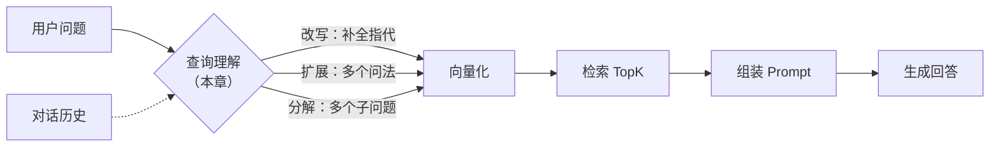

# 第 6 章 查询理解与改写：让用户的问题更可检索

> 一句话总结：搞懂为什么用户的原始问题不是好的检索输入，掌握查询改写、查询扩展、HyDE、子查询分解四种查询处理技术。

## 三个检索翻车的现场

模块一搭起来的检索链路有个隐含假设：用户的问题拿过来就能直接检索。真实用户根本不这么说话。看三个翻车现场，语料还是那份公司制度。

**现场一：指代。** 用户先问「出差住宿标准是多少」，系统答了。用户追问：「那二线城市呢？」拿「那二线城市呢」去向量库检索——这六个字里没有任何实质内容，Embedding 模型再强也算不出它和住宿条款的关系。检索大概率给你拉回年假或加班，答案全错。

**现场二：口语。** 用户问「住酒店能报多少」。制度原文是「住宿标准：一线城市每晚不超过 500 元」。这条向量检索倒是能沾上（第 2 章见过类似例子），但如果换成更口语的「出差住一宿最多给报几个钱」，语义距离就被拉远了，排名开始不稳。

**现场三：多意图。** 用户问「年假几天，加班费怎么算，报销找谁批」。一个问题三件事情，取向量时三个意图被平均成一个坐标，三件事相关的块排名都不上不下，检索结果东一榔头西一棒子。

三个现场的共同病根：**用户的「表达方式」和检索器需要的「输入形态」之间有落差**。填这个落差的环节叫查询理解（Query Understanding），在链路里的位置是：用户问题 → 【查询理解】→ 检索 → 生成。它发生在查询期的最前端，晚于收到问题，早于 Embedding。

## 招式一：查询改写——把问题补全成自包含的句子

**查询改写（Query Rewriting）** 解决现场一：借助对话历史，让 LLM 把当前问题改写成一句不依赖上下文也能看懂的「自包含」问题。

「那二线城市呢？」经过改写变成「出差住宿二线城市每晚的标准是多少？」——这句话拿去做向量检索，和住宿条款的语义距离立刻拉近。改写前后的差距，就是上下文有没有被补进去的差距。

动手实现。新建 `query-rewrite.ts`：

```ts
import "dotenv/config";
import OpenAI from "openai";

const client = new OpenAI({
  apiKey: process.env.LLM_API_KEY,
  baseURL: process.env.LLM_BASE_URL,
});

type Message = { role: "user" | "assistant"; content: string };

// 把「历史 + 当前问题」改写成自包含检索句
async function rewriteQuery(history: Message[], question: string): Promise<string> {
  // 没有历史时没什么可补的，直接用原问题（省一次 LLM 调用）
  if (history.length === 0) return question;

  const historyText = history
    .map((m) => `${m.role === "user" ? "用户" : "助手"}：${m.content}`)
    .join("\n");

  const resp = await client.chat.completions.create({
    model: process.env.LLM_MODEL!,
    messages: [
      {
        role: "system",
        content:
          "你是查询改写器。根据对话历史，把用户的最新问题改写成一个不依赖上下文也能理解的完整问句。" +
          "只输出改写后的问句本身，不要解释，不要回答问题的内容。",
      },
      { role: "user", content: `【对话历史】\n${historyText}\n\n【最新问题】\n${question}` },
    ],
  });
  return resp.choices[0].message.content!.trim();
}

const history: Message[] = [
  { role: "user", content: "出差住宿标准是多少？" },
  { role: "assistant", content: "一线城市每晚不超过 500 元，其他城市不超过 350 元。" },
];

const rewritten = await rewriteQuery(history, "那二线城市呢？");
console.log("改写后：", rewritten);
// 预期输出类似：出差住宿二线城市每晚的报销标准是多少？
```

三个设计细节值得停下来看。第一，`history.length === 0` 时直接返回原问题——首轮提问没有上下文，改写是纯粹浪费一次调用，还引入失真风险。「什么时候不做」和「怎么做」同样重要。第二，system 里明确「只输出问句，不要回答问题」——不拦着的话，模型很可能直接把答案写出来，你拿到的就不是检索句了。第三，改写用的模型不需要多强，这是个轻任务，免费档的 glm-4.7-flash 完全够，成本可以忽略。

还有两个生产细节。一是历史别全塞：对话聊了三四十轮，全丢给改写器，关键信息反而被淹没。取最近 3–5 轮足够覆盖指代（人追问时的指代很少跨十几轮），更长的历史管理是第 14 章对话历史压缩的话题。二是改写要「保真」：生产级的改写 prompt 通常还要补两条约束——保留原问题里的专有名词和数字（别把「iPhone 15」泛化成「手机」），不新增原问题没有的意图（别替用户脑补需求）。改写是翻译，不是创作。

## 招式二：查询扩展——一个问题，多种问法

**查询扩展（Query Expansion）** 解决另一种不稳：同一个意思，用户的说法和文档的说法可能各长一个样，单次检索只能赌一种表达。扩展的做法是让 LLM 围绕原问题生成几个等价问法：

```ts
async function expandQuery(question: string): Promise<string[]> {
  const resp = await client.chat.completions.create({
    model: process.env.LLM_MODEL!,
    messages: [
      {
        role: "system",
        content: "把用户的问题改写成 3 个意思相同但表述不同的问句，每行一个，只输出问句。",
      },
      { role: "user", content: question },
    ],
  });
  return resp.choices[0].message.content!.trim().split("\n").filter(Boolean);
}

// 「住酒店能报多少」可能扩展出：
// 出差住宿费用的报销额度是多少
// 酒店住宿费的报销标准是什么
// 出差住酒店一晚最多能报销多少钱
```

然后每个问法各自检索一次，把几路结果合并去重——这叫**多路召回（Multi-query Retrieval）**。任何一路命中了正确块，正确答案就进了候选集。它的本质是「用多次检索换召回率」，赌的是几种表达里总有一种和文档的说法靠得近。现场二的口语问题走的就是这条路：「出差住一宿最多给报几个钱」直接检索不稳，但扩展出的「出差住宿报销标准是多少」和文档的措辞几乎贴脸。

多路召回引出一个新问题：几路结果怎么合成一个排序？这牵涉分数融合，第 7 章讲 RRF 时正面解决。现在先记住「多路召回」这个词，它是混合检索的前奏。

## 招式三：HyDE——先编一个假答案

**HyDE（Hypothetical Document Embeddings，假设性文档嵌入）** 是四种招式里最反直觉的：不让模型改写问题，而是让它**直接编一个假答案**，然后拿假答案的向量去检索。

```ts
async function hydeDocument(question: string): Promise<string> {
  const resp = await client.chat.completions.create({
    model: process.env.LLM_MODEL!,
    messages: [
      {
        role: "system",
        content: "写一段回答用户问题的假设性文字，语气像制度原文，100 字以内。内容可以不准确。",
      },
      { role: "user", content: question },
    ],
  });
  return resp.choices[0].message.content!.trim();
}

// 问题：住酒店能报多少
// 假答案可能是：员工出差住宿费用按城市等级设定标准，
// 一线城市每晚不超过 500 元，超标部分自理……
```

为什么编个可能错误的答案反而有用？关键在于**向量空间里「答案和答案」的距离，比「问题和答案」的距离更近**。问题「住酒店能报多少」是疑问句，文档「住宿标准：……」是陈述句，两者语言形态差异本身就会拉开向量距离。而假答案和真答案同为陈述句、同样的措辞腔调，哪怕数字编错了（它可能编个 600 元），语言形态和用词仍与真实文档高度相似，向量就非常接近。检索到真文档后，生成环节用的是真文档的内容，假答案的编造部分根本不会进入最终答案。

代价和边界也清楚：多一次生成调用，时延明显上升；对模型完全不懂的领域，假答案可能编得南辕北辙，反而带偏检索。它适合「文档是规范陈述文体、问题与文本文体差异大」的语料，比如制度、手册、论文。

## 招式四：子查询分解——把大问题拆小

**子查询分解（Query Decomposition）** 解决现场三的多意图：让 LLM 把复合问题拆成几个独立的子问题，每个子问题单独检索，把各自的结果一起交给生成环节。

```text
「年假几天，加班费怎么算，报销找谁批」
  ├─ 子问题 1：年假的天数如何计算？
  ├─ 子问题 2：加班费的计算标准是什么？
  └─ 子问题 3：报销的审批流程是怎样的？
```

拆开后每个子问题语义单一，向量指向明确，三块相关制度各归各位。生成时模型拿到三组证据，组织一个分点回答。代码骨架和扩展几乎同构，只是 prompt 的目标不同：

```ts
async function decomposeQuery(question: string): Promise<string[]> {
  const resp = await client.chat.completions.create({
    model: process.env.LLM_MODEL!,
    messages: [
      {
        role: "system",
        content:
          "把用户的复合问题拆成若干个可以独立回答的子问题，每行一个。" +
          "如果问题本身单一意图，原样返回即可。只输出子问题。",
      },
      { role: "user", content: question },
    ],
  });
  return resp.choices[0].message.content!.trim().split("\n").filter(Boolean);
}
```

注意「单一意图原样返回」这条退路——和改写器「无历史不改写」是同一个纪律：简单的输入不要制造多余的加工。

分解不止用于多意图。对「对比 A 和 B 的住宿标准差异」这类需要多步推理的问题，也可以拆成「A 的标准是什么」「B 的标准是什么」两个检索步骤——这已经有点 Agent 多步执行的味道了，第 11 章讲 Agentic RAG 时会把这个思路推到更复杂的形态。

## 实验：改写前后的多轮问答对比

把第 5 章的 pgvector 库用起来，完整走一遍「指代翻车 → 改写修复」的对照。假设 `chunks` 表里已按真实 Embedding 入库了制度文档的块（用第 2 章的方法把五段制度向量化写入，维度换成你的模型实际维度）。

```ts
import pg from "pg";
const { Pool } = pg;
const pool = new Pool({ host: "localhost", database: "ragcourse", user: "postgres", password: "rag123" });

async function search(query: string, topK = 2) {
  const emb = await client.embeddings.create({ model: process.env.EMBEDDING_MODEL!, input: query });
  const vec = `[${emb.data[0].embedding.join(",")}]`;
  const { rows } = await pool.query(
    `SELECT content, embedding <=> $1 AS distance FROM chunks ORDER BY distance LIMIT $2`,
    [vec, topK]
  );
  return rows;
}

const followUp = "那二线城市呢？";

console.log("=== 直接检索原始问题 ===");
console.log(await search(followUp));

console.log("=== 检索改写后的问题 ===");
const rewritten = await rewriteQuery(history, followUp);
console.log("改写为：", rewritten);
console.log(await search(rewritten));
```

跑两遍对比（改写函数复用前面的）。预期现象类似这样（数字为示例，重点看结构）：

```text
=== 直接检索原始问题 ===
[ { content: '年假按工龄计算……', distance: 0.52 },
  { content: '加班需提前在 OA 系统申请……', distance: 0.55 } ]

=== 检索改写后的问题 ===
改写为：出差住宿二线城市每晚的报销标准是多少？
[ { content: '出差住宿标准：一线城市每晚不超过 500 元……', distance: 0.18 },
  { content: '员工因公发生的费用，应在 30 天内……', distance: 0.44 } ]
```

直接检索「那二线城市呢？」时，TopK 结果和问题八竿子打不着，距离普遍偏大；改写后的检索，住宿标准块回到第一名，距离明显更小。把两次的距离数字摆在一起，「改写值不值那一次 LLM 调用」就是一道算术题了。

## 查询理解在链路里的位置

回过头看全景，本章的内容插在查询期的最前端：



注意对话历史在这条链路里出现了两次：一次在这里（帮检索理解问题），一次在组装 Prompt 时（帮生成理解语境）。两次的用途完全不同，第 14 章实现时会看到它们各自的处理方式。

## 四种招式怎么选

| 招式 | 解决什么 | 额外成本 | 什么时候上 |
| --- | --- | --- | --- |
| 查询改写 | 指代、省略、多轮上下文 | 一次轻量 LLM 调用 | 有多轮对话就该上，性价比最高 |
| 查询扩展 | 表达差异导致的召回不稳 | 一次 LLM 调用 + 多路检索 | 单轮问答、文档措辞多样 |
| HyDE | 问题与文档文体差异大 | 一次生成调用（最慢） | 规范文体语料（制度/手册/论文） |
| 子查询分解 | 多意图、多步问题 | 一次 LLM 调用 + 多路检索 | 复合问题多的场景 |

它们不是单选题，可以叠加：先分解，每个子问题再各自改写。但每叠一层就多一份时延和费用，工程纪律是「没有 badcase 不加招式」——第 10 章学了评估，你就能用数据证明每一层到底带来了多少提升，而不是凭感觉堆料。

## 附：一个生产形态的改写 Prompt

把前面散落的约束收拢成一份可以直接抄进项目的改写器 prompt：

```text
你是查询改写器。根据对话历史，把用户的最新问题改写成
一个不依赖上下文也能理解的完整问句，用于检索。

要求：
1. 只输出改写后的问句本身，不要回答问题，不要解释。
2. 保留原问题中的专有名词、数字、时间等限定条件。
3. 不添加原问题没有的意图或假设。
4. 最新问题本身已经完整独立时，原样输出。
```

第 2 章说过「RAG 系统的后半截是精心设计的 Prompt Engineering」，这就是第一份样品：短短几行，每一条都对应一种实测过的翻车方式。写约束不难，难的是知道该约束什么——那只能从 badcase 里长出来。

## 常见误区

**误区一：所有问题都过改写。** 首轮、明确、单一意图的问题，改写纯属浪费还可能改丢信息。先看有没有历史、有没有指代，再决定动不动手。

**误区二：改写器顺手把问题答了。** 没在 system 里摁住「只输出问句」，模型经常直接给答案。这个答案一旦被你当成检索句发去向量库，整条链路就悄悄变了味。这是实测中最常见的翻车姿势。

**误区三：HyDE 的假答案会污染最终答案。** 不会——假答案只参与检索，进 Prompt 的是检索到的真文档。但反过来也要警惕：如果检索质量差到把「和假答案相似的错误文档」捞出来，生成环节照样会被带偏。HyDE 放大的始终是检索本身的质量。

**误区四：扩展出来的问法越多越好。** 扩展问法一走题，多路召回带回来的就是多路噪声。三条左右是常见甜点位，而且 prompt 里要摁住「意思相同」这条红线。还有一种更隐蔽的翻车：扩展问法把原问题的限定条件丢了（「2025 年的报销标准」扩展成「报销标准是多少」），召回的内容虽然相关但答非所问。限定词（时间、范围、主体）必须在扩展时保留。

## 小结与自测

本章给查询期装上了前端大脑：用户表达与检索输入之间的落差是真实存在的（指代、口语、多意图三个现场）；四种招式各自的靶子和成本（改写管上下文、扩展管表达差异、HyDE 管文体差异、分解管多意图）；「没有 badcase 不加招式」的工程纪律。

自测：

1. 「那它多少钱」这类指代问题，为什么向量检索天然处理不了？改写是怎么修复的？
2. HyDE 的假答案内容可能是错的，为什么不会拉低最终答案的正确率？它放大的又是什么？
3. 查询扩展和子查询分解都会产生「多路检索」，它们的适用问题有什么不同？
4. 一个没有对话历史的单轮 FAQ 机器人，四种招式里哪几种基本用不上？为什么？
5. 给改写函数设计 system prompt 时，最容易漏掉的一条约束是什么？漏了会怎样？

下一章转向检索的另一条腿：BM25 与混合检索。第 3 章埋的「错误码 E1002 召回成 E1003」的账，该还了。
