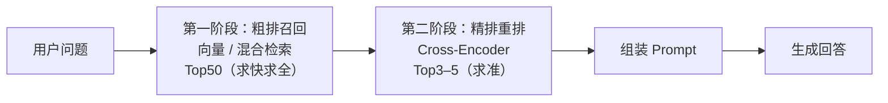

# 第 8 章 重排序 Re-ranking：粗排之后还要精排

> 一句话总结：搞懂两阶段检索架构与 Cross-Encoder 原理，给召回结果加上一道精排工序，把「排第 7 的正确答案」捞进 Top3。

## 从「检索到了，但答错了」的怪现象开始

排查一个诡异的 badcase：知识库里明明有答案，检索日志显示相关块**被召回了**，但模型的回答却像没看见它。

翻出完整的召回列表一看：正确的块排在召回结果的第 7 名。而组装 Prompt 时，系统只取前 3 名。第 7 名连见到模型的机会都没有——召回立功了，排序输了。

这个现象的普遍性超出直觉。第 3 章的相似度矩阵实验里，「发票」那句拿到过一个「沾边但不命中」的中间分——向量空间里，**语义沾边**和**真正回答问题**的块经常挤在一起。召回放大到 Top50，这种「中间分选手」会混进来一大批，把正确答案挤到后排。取 Top3 给模型，等于从 50 个候选人里按一个粗糙的分数选 3 个，选错是常态。

解法不是把 Top3 改成 Top50（上下文窗口和成本都不答应，第 9 章算这笔账），而是加一道工序：**重排序（Re-ranking）**。用便宜粗放的检索先召回一大批（Top50），再用精准但昂贵的模型对这 50 个候选重新打分排序，取精排后的 Top3。

## 两阶段检索架构



两个阶段的分工是一句口诀：**粗排求召回，精排求精度**。粗排的标准是「正确答案别漏」，宁可错杀三千（多召回些噪声）；精排的标准是「排前面的必须能打」，从粗排的候选里把真正的答案顶到最前。

为什么要分两阶段，而不是直接用精准的模型搜全库？算一笔账：精排模型对「查询 + 文档」逐对打分，全库一百万块就是一百万次模型前向，一次查询跑到天黑。而粗排的向量检索有 ANN 索引，毫秒级完成。用粗排把一百万砍到 50，精排只需打 50 次分——两个模型的成本特性被用在了各自擅长的规模上。

## 为什么 Embedding 粗排会丢精度

粗排为什么会把「中间分选手」放进来？根子在 Embedding 的工作方式上。

Embedding 模型是**双塔结构**：查询和文档各自独立编码成向量，互不见面。「怎么申请退款」变成向量 A，「退货流程」变成向量 B，编码完成之前，模型不知道对方的存在。相似度是事后拿两个向量算出来的。

这种结构是检索速度的前提——文档向量可以预先算好存库，查询来了只算一个向量。但代价是**交互信息丢失**：「发票抬头写错了能改吗」和「退款流程」在各自编码时，都只能表达「我和售后财务有关」这层意思，没法表达「我和你是不是在回答同一个问题」。两个「售后财务」向量的距离自然很近——中间分就是这么来的。

## Cross-Encoder：让查询和文档面对面

**Cross-Encoder（交叉编码器）** 换了一种结构：把查询和文档**拼接起来一起输入**模型，让模型通读这一对文本后，直接输出一个相关度分数。

```text
双塔（Embedding）:  查询 → [模型] → 向量A ┐
                    文档 → [模型] → 向量B ┘→ 算距离（事后比）

交叉（Cross-Encoder）: [查询；文档] → [模型] → 相关度分数（一起读）
```

查询和文档在模型内部逐层交互，模型能看到「用户问的是 A 问题的解决步骤」对「这段讲的是 B 问题的背景」这种细粒度的对应关系——「退款」和「发票」这种双塔分不清的邻居，交叉编码器一眼看穿。

两种结构的对照收拢一下：

| | 双塔（Embedding） | 交叉（Cross-Encoder） |
| --- | --- | --- |
| 输入方式 | 查询、文档各自独立编码 | 查询和文档拼接后一起输入 |
| 输出 | 向量（事后算距离） | 直接输出相关度分数 |
| 可预计算 | 文档向量可预先入库 | 不可预计算，每对现算 |
| 单次成本 | 极低（一次编码 + 向量比对） | 高（每对一次完整前向） |
| 精度 | 粗（交互信息丢失） | 细（逐对细读） |
| 战场 | 全库粗排召回 | 候选集精排重排 |

它为什么能看得这么细？训练数据是海量的「查询 + 文档 + 相关/不相关」标注对（比如搜索引擎的点击数据），模型被要求直接学习「这一对是否相关」的判断。Embedding 模型学的是「把语义编码进坐标」，重排模型学的是「判断这一对配不配」——目标不同，分工自然不同。

代价同样清楚：没有可预计算的索引。每一对「查询+文档」都要完整跑一次模型，这就是它只能当精排用的根本原因。50 对，可接受；一百万对，不可能。

一句话记住分工：双塔管「从大海里捞针的范围」，交叉管「在捞上来的一堆里挑出真正的针」。

## 主流方案选型

| 方案 | 形态 | 亮点 | 代价 |
| --- | --- | --- | --- |
| bge-reranker 系列（BAAI） | 开源模型，本地跑 | 免费、数据不出网、中文好（v2-m3 多语言） | 吃本机算力，每次重排几十到几百毫秒 |
| Cohere Rerank | 云 API | 效果好、接入简单 | 按次计费，数据出内网 |
| 智谱 glm-rerank | 云 API | 国内直连，约 0.8 元/百万 token（2026-07 核验） | 同上 |
| LLM 逐对打分 | 复用现有聊天模型 | 零新增依赖，随时可用 | 最贵最慢，只能应急或小规模 |

选型和第 3 章 Embedding 的逻辑一脉相承：能出网就云 API，不能出网就本地开源模型。LLM 逐对打分（把「查询+文档+打个相关分」发给 glm-4.7-flash）适合验证想法，别用于日常流量。

LLM 打分这条应急路径的代码也简单，顺手放在这里：

```ts
// 应急方案：让聊天模型当重排器（只建议离线验证用）
async function llmScore(query: string, doc: string): Promise<number> {
  const resp = await client.chat.completions.create({
    model: process.env.LLM_MODEL!,
    messages: [
      {
        role: "system",
        content: "判断文档能否回答查询，只输出 0 到 1 之间的一个数字，越大越相关。",
      },
      { role: "user", content: `【查询】${query}\n【文档】${doc}` },
    ],
  });
  return parseFloat(resp.choices[0].message.content!) || 0;
}
```

它能跑，但看一眼就明白为什么不能上生产：每个候选一次 LLM 调用，50 个候选就是 50 次——时延和费用都是专用 reranker 的几十倍。它的正确用途是快速验证「加一道精排到底有没有提升」，验证有效再换正规军。

## 实操：两条路径都走一遍

### 路径一：本地跑 bge-reranker（零成本，可离线）

浏览器和 Node 都能跑模型的 `@huggingface/transformers` 库，把 bge-reranker 拉到了 TypeScript 世界：

```bash
npm install @huggingface/transformers
```

```ts
import { AutoTokenizer, AutoModelForSequenceClassification } from "@huggingface/transformers";

// 首次运行会下载模型文件（几百 MB），之后走本地缓存
const tokenizer = await AutoTokenizer.from_pretrained("Xenova/bge-reranker-base");
const model = await AutoModelForSequenceClassification.from_pretrained("Xenova/bge-reranker-base");

const sigmoid = (x: number) => 1 / (1 + Math.exp(-x));

async function rerankScore(query: string, doc: string): Promise<number> {
  // 查询和文档拼成一对输入模型（Cross-Encoder 的标志性动作）
  const inputs = await tokenizer(query, { text_pair: doc });
  const { logits } = await model(inputs);
  return sigmoid(logits.data[0]); // 原始 logit 经 sigmoid 压到 0–1
}

const query = "E1002 怎么解决";
const candidates = [
  "错误码 E1002 表示数据库连接池耗尽，应检查连接泄漏并调大池上限。",
  "错误码 E1003 表示数据库连接超时，应检查网络与慢查询。",
  "每周五 18:00 执行例行维护，期间服务只读。",
];

for (const doc of candidates) {
  console.log((await rerankScore(query, doc)).toFixed(4), doc.slice(0, 18));
}
```

这段代码是在 Node 22 上实测过的，真实输出：

```text
0.9776  错误码 E1002 表示数据库连接
0.0084  错误码 E1003 表示数据库连接
0.0520  每周五 18:00 执行例行维护
```

E1002 那条 0.98，E1003 被压到 0.008——第 7 章向量检索分不清的 ①②，交叉编码器分得一清二楚。

代码里有个实测踩出来的坑要交代：bge-reranker 这类单 logit 输出的模型，如果用更简短的 `pipeline("text-classification", ...)` 封装，返回的 `score` 字段是单类别归一化后的值——**任何输入都得到 1.0**，毫无区分度。必须像上面这样直接读原始 logits 再过 sigmoid。如果你以后把某个 reranker 接进系统发现「怎么所有分数都一样」，回来找这一段。

另外两个实用提示：首次下载模型如果连 Hugging Face 不稳，设镜像环境变量再跑——`HF_ENDPOINT=https://hf-mirror.com`（本次实测就是靠它下载成功的）；想换更强模型，把 `Xenova/bge-reranker-base` 换成 `Xenova/bge-reranker-v2-m3`（多语言版，中文场景更稳），模型文件更大但用法完全一样。

### 路径二：云 API 重排（以 Cohere Rerank 为例）

云 API 的形态更简单，一个请求把候选列表全发过去：

```ts
const resp = await fetch("https://api.cohere.com/v2/rerank", {
  method: "POST",
  headers: {
    Authorization: `Bearer ${process.env.COHERE_API_KEY}`,
    "Content-Type": "application/json",
  },
  body: JSON.stringify({
    model: "rerank-v3.5",
    query: "E1002 怎么解决",
    documents: candidates,
    top_n: 3,
  }),
});
const { results } = await resp.json();
// results: [{ index: 0, relevance_score: 0.98 }, ...] 按分数降序
```

智谱 glm-rerank 是同形态的服务，请求结构几乎一样（端点和字段名以官方文档为准）。两条路径的接口都收敛到同一个抽象：**输入查询和候选列表，输出按相关度重排的列表**——这就是重排器的统一形态，换供应商只是换实现。

### 接入检索链路

重排器在链路里的位置（回顾第 6、7 章的成果）：

```ts
// 伪代码骨架：前面章节的真实部件在这里合流
const rewritten = await rewriteQuery(history, question);        // 第 6 章：改写
const vectorHits = await vectorSearch(rewritten, 30);           // 第 5 章：向量召回 Top30
const bm25Hits = bm25Search(rewritten, 30);                     // 第 7 章：BM25 召回 Top30
const fused = rrf([vectorHits, bm25Hits]);                      // 第 7 章：RRF 融合
const candidates = topK(fused, 50);                             // 粗排出炉：Top50

const reranked = await rerank(question, candidates);            // 本章：精排
const finalChunks = reranked.slice(0, 5);                       // 交给生成环节的 Top5
```

从 50 到 5 的这一刀，就是重排序的全部工作。

## 实验：重排前后的位置变化

设计一个「中间分陷阱」实验，亲眼看重排把正确答案从后排捞上来。语料里埋三条「沾边但不命中」的干扰块：

```ts
const query = " pgvector 里怎么给向量列建 HNSW 索引？";
const candidates = [
  "HNSW 是 pgvector 推荐的索引类型，使用多层图结构加速近邻搜索。",     // 沾边：讲概念
  "CREATE INDEX ON chunks USING hnsw (embedding vector_cosine_ops);",   // 真正答案：建索引 SQL
  "IVFFlat 是另一种索引，按聚类分桶，适合数据量更大的场景。",           // 沾边：讲另一种
  "相似度查询用 ORDER BY embedding <=> 查询向量 来实现。",              // 沾边：讲查询
  // ……更多干扰块
];
```

向量粗排下，「讲概念」「讲另一种索引」「讲查询」这些块和问题的语义距离都很近，真正的 SQL 答案经常混在中间。跑一次重排，观察 `CREATE INDEX` 那条从第几名跳到第 1 名。这个「位置变化」就是重排价值的最直观度量。

建议把观察做成一张小表，打印重排前后两份 Top5 对照着看：

```text
重排前（粗排 Top5）              重排后（精排 Top5）
1. HNSW 是推荐的索引类型…        1. CREATE INDEX ON chunks USING hnsw…  ← 从第 3 捞到第 1
2. IVFFlat 是另一种索引…         2. HNSW 是推荐的索引类型…
3. CREATE INDEX ON chunks…       3. 相似度查询用 ORDER BY…
4. 相似度查询用 ORDER BY…        4. IVFFlat 是另一种索引…
5. （无关块）                    5. （无关块）
```

更系统的度量方法（命中率、MRR、NDCG）第 10 章会正式讲。现在先建立一个粗糙但好用的观察：**分别打印重排前后的 Top5，数一数正确答案在不在、排第几**。第 10 章你会发现，这就是 MRR 指标的手工版。

## 重排和第 7 章的 RRF 是什么关系

一个容易绕晕的问题：第 7 章的 RRF 也在「重新排序」，本章的重排也在「重新排序」，重复了吗？

不重复，它们干的是不同层级的事。RRF 是**融合**：把向量路和 BM25 路两个榜单合成一个榜单，输入是多路排名，输出是统一排名，它不知道每个候选「到底相不相关」。重排是**精判**：拿一个模型逐对细读，直接给出相关度分数。在完整链路里它们是接力关系——多路召回先由 RRF 合成一个粗排榜单（Top50），再交给重排器精判（出 Top5）。只用单路向量召回的系统不需要 RRF，但照样可以加重排；只有一路召回还嫌麻烦不加融合的小系统，重排依然是性价比最高的单点升级。

## 阈值、截断与时延预算

重排器的分数还有一个妙用：它天然适合做「相关性门槛」。粗排的相似度分数跨模型不可比（第 3 章），但重排分数是「这对文本相关吗」的直接回答，0 到 1 的语义清晰。于是可以定一条规则：重排分数低于阈值（比如 0.3）的块直接丢弃；Top5 全低于阈值，说明库里大概率没有答案——触发拒答。这是第 9 章拒答策略的技术基础，现在先把因果链埋好。

候选集取多大也有讲究。太小（Top10），粗排的失误没有被精排挽救的机会；太大（Top500），重排时延失控，而且大量低质候选会稀释精排表现。经验甜点位是 **20 到 100**，配合「粗排路数」调整：单路向量召回取小些，混合检索多路候选取大些。

时延账也要算：本地 bge-reranker-base 对 50 个候选打分，CPU 上大约几百毫秒到一秒；云 API 类似。这是加在用户每次问答上的固定开销。把几条路径的成本特性摆在一起：

| 路径 | 50 候选重排时延（量级） | 费用 | 数据出网 |
| --- | --- | --- | --- |
| 本地 bge-reranker-base | 数百 ms – 1 s（CPU） | 零 | 否 |
| 本地 bge-reranker-large | 秒级（CPU） | 零 | 否 |
| 云 Rerank API | 数百 ms | 按量计费 | 是 |
| LLM 逐对打分 | 数十秒 | 最贵 | 是 |

对时延敏感的场景，可以缩小候选集、换更小的 reranker 模型，或者只对「粗排分数不自信」的请求启用重排（头部粗排分数很高时跳过）。重排是默认开启项，但不是不可拆的螺丝。

## 常见误区

**误区一：重排能救回所有检索失败。** 重排只能对粗排**交上来的候选**排序。正确答案压根没被召回时，精排模型再强也无米下锅。「先保证召回，再追求精度」是两阶段架构的铁律——粗排的 TopK 不能抠门。

**误区二：候选集越大越保险。** 候选集翻倍，重排时延基本翻倍，而召回率的边际收益急剧下降。Top200 以上的候选集通常是在为粗排的不自信交税，不如回去修粗排。

**误区三：直接拿大模型当重排器。** 让 glm-4.7-flash 逐对打分，一次问答几十次调用，成本和时延都失控。LLM 打分适合离线评估和小规模验证，在线流量用专门的 reranker 模型——它就是为这件事训练出来的，便宜两个数量级。

## 小结与自测

本章补上了检索链路的最后一道工序：「召回有、生成错」的病根是粗排精度（双塔的交互信息丢失）；两阶段架构的分工（粗排求召回、精排求精度）；Cross-Encoder 的原理与成本结构（为什么只能用于重排）；本地 bge-reranker 与云 API 两条接入路径；阈值拒答的技术伏笔和候选集甜点区间。

站在模块二的中点回头看，你的检索链路已经从第 2 章的「向量检索一把梭」升级成了全副武装：

| 环节 | 部件 | 来自 |
| --- | --- | --- |
| 查询理解 | 改写 / 扩展 / 分解 | 第 6 章 |
| 多路召回 | 向量 + BM25 | 第 3、5、7 章 |
| 融合 | RRF | 第 7 章 |
| 精排 | Cross-Encoder 重排 | 第 8 章 |

自测：

1. 双塔结构为什么会产生「中间分选手」？Cross-Encoder 靠什么机制看穿它？
2. 为什么不能拿 Cross-Encoder 直接对全库一百万文档打分？
3. 「召回率已经 95%，但 Top3 命中率只有 40%」，这句话描述的是哪个阶段的问题？怎么修？
4. 重排分数阈值设为 0，和设为 0.9，系统行为分别会变成什么样？
5. 时延预算紧张的场景，有哪三个手段可以降低重排开销？
6. RRF 和重排都在改变排序，它们的输入、判断依据和适用层级分别是什么？

检索侧到此毕业：改写、混合、重排，查询期的前半段全副武装。下一章转进生成侧：检索结果怎么组装进 Prompt、答案怎么标注出处、查不到时怎么体面地拒答。
