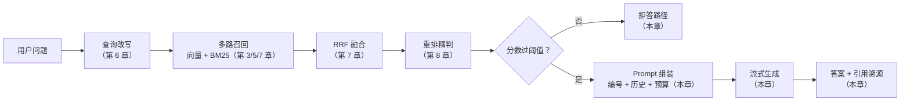

# 第 9 章 生成侧优化：Prompt 组装、引用溯源与拒答

> 一句话总结：学会把检索结果组装成高质量 Prompt，给答案加上引用溯源，并在查不到时让系统体面地拒答。

## 检索满分，答案照样翻车

前面六章把检索侧武装到了牙齿：改写、混合、重排，Top5 里躺着正确答案。很多团队走到这一步就宣布上线了，然后被用户教育：

模型对 Top5 里的答案视而不见，自顾自凭印象作答；三块资料互相矛盾时，模型把它们搅成一锅粥；明明库里没有相关内容，模型照样侃侃而谈；用户问答案哪来的，系统说不出来。

检索侧的满分，保不了生成侧的及格。这一章管的就是查询期的后半段：**检索结果怎么组装进 Prompt，模型怎么被约束着用这些资料，答案怎么标注出处，没资料时怎么收场**。第 2 章说过「RAG 系统的后半截是一场精心设计的 Prompt Engineering」，现在兑现这句话。

## RAG Prompt 的解剖结构

一个生产形态的 RAG Prompt 有四个组成部分，各有各的职责：

```text
┌─────────────────────────────────────────────┐
│ ① 系统指令（system）                          │
│   角色、回答规则、引用格式要求、拒答条件        │
├─────────────────────────────────────────────┤
│ ② 检索上下文（编号的资料块）                   │
│   [1] 差旅标准：一线城市每晚不超过 500 元……    │
│   [2] 报销应在费用发生后 30 天内提交……         │
├─────────────────────────────────────────────┤
│ ③ 对话历史（最近几轮问答）                     │
├─────────────────────────────────────────────┤
│ ④ 用户当前问题                                │
└─────────────────────────────────────────────┘
```

四个部分里，①决定模型「怎么对待资料」，②决定模型「看到什么证据」，③维持多轮语境，④是任务本身。新手常犯的错误是把资料随随便便往问题前面一糊——没有编号、没有规则、没有拒答约定，然后奇怪模型为什么不听话。

## 上下文组装：不只是拼接

把检索块拼进 Prompt 时，几个细节直接影响答案质量。

**给块编号。** 每块前面加 `[1]` `[2]` 标记，成本几乎为零，回报是双份的：模型被引导着「按编号引用资料」，引用溯源才有了实现基础；回答多块矛盾时，你能从答案的引用编号看出模型采信了谁。

**按相关度排序，最重要的放两头。** 研究发现一个被称为 **Lost in the Middle（中间丢失）** 的现象：模型对 Prompt 开头和结尾的内容利用得最好，中间部分容易被「读漏」。塞七八块资料时，最相关的一块放在最前或最后，比埋在中间更可能被模型真正用上。这也是为什么重排后的 Top5 要按分数排好序再进 Prompt，而不是随手一塞。

**去重与裁断。** 混合检索多路召回可能带回重复块（第 7 章的 RRF 输入去重过吗？相邻块重叠内容重复吗？），重复内容既浪费 Token 又稀释注意力。超长块在进 Prompt 前按预算裁断，别让一块吃掉整个窗口。

**多块矛盾时提前想好后路。** 制度修订过，库里新老两版并存：旧块写「住宿 500 元」，新块写「住宿 550 元」。模型拿到互相矛盾的两块，可能和稀泥出一个「525 元左右」——比任何一版都错。两个对策：入库侧给元数据加时间戳，检索时优先新文档；指令侧写明「资料冲突时全部列出并注明出处，不要折中」。后者就是一行指令的事，前面指令模板的第 3 条就是干这个的。

## Token 预算：一笔必须算的账

第 1 章说上下文窗口是有限资源，现在把它落实成数字。假设模型窗口 128K token，一次问答的预算这样分：

| 预算项 | 建议量级 | 说明 |
| --- | --- | --- |
| 系统指令 | 200–500 | 规则写清楚就行，别写小作文 |
| 检索上下文 | 3000–4000 | Top5、每块 500–800 token 是常见配置 |
| 对话历史 | 1000–2000 | 近 5 轮左右；超了要压缩（第 14 章展开） |
| 用户问题 | 几十到几百 | — |
| 给答案预留 | 1000–2000 | max_tokens 别卡太死，答案被腰斩很蠢 |

加起来不到 10K，128K 的窗口绰绰有余——这正是第 1 章「窗口大了 RAG 依然必要」的实证：实际工作预算远小于窗口上限，因为**多塞不等于好用**。检索块从 5 块加到 20 块，答案质量通常先升后降：噪声稀释了信号，中间丢失加剧，费用还翻了倍。Token 预算的目标不是塞满，是让每一份 token 都是有效证据。

落地时怎么知道一块多少 token？学习阶段继续用字符数估算（中文字符数 ≈ token 数，误差在可接受范围）；计费敏感的生产系统用模型厂商的 tokenizer 接口精确算，或者在 Embedding 入库时就把每块的 token 数存进元数据——第 4 章的 chunks 表设计里那个 `token_count` 字段，就是为这一刻准备的。

## 引用溯源：让答案能交代出处

第 4 章挂的元数据，到收获的时候了。引用溯源的完整链路是：检索块带编号进 Prompt → 指令要求模型按编号标注 → 答案文本里出现 `[1]` `[2]` → 前端把编号映射回 chunk 的元数据（文档名、标题、原文）展示给用户。

关键在系统指令的写法：

```text
你是公司行政助手。仅根据【资料】回答问题，遵守以下规则：
1. 回答中引用的每处事实，在句末用 [n] 标注来源编号（n 为资料编号）。
2. 资料中没有的信息，明确回答「根据现有资料无法回答」，不要编造。
3. 多块资料内容冲突时，都列出来并注明各自编号。
```

模型侧的遵守程度因模型而异，glm-4.7-flash 这个量级对编号引用已经相当听话。但要明白一个边界：**引用标注是模型的承诺，不是系统的保证**——它可能标错编号，也可能标了引用却曲解原文。严格的系统会做一层校验：答案里的每个 `[n]` 是否都在资料编号范围内、该块是否真与答案相关。这层校验实战项目不展开，但思路要知道（第 10 章的 Faithfulness 评估就是干这个的量化版）。

编号到元数据的映射在代码里就是个查表：

```ts
// 检索时保留编号 → chunk 的映射
const citationMap = new Map<number, Chunk>();
finalChunks.forEach((chunk, i) => citationMap.set(i + 1, chunk));

// 答案出现后，按 [n] 取出引用详情
function resolveCitations(answer: string) {
  const ids = [...answer.matchAll(/\[(\d+)\]/g)].map((m) => Number(m[1]));
  return [...new Set(ids)]
    .filter((id) => citationMap.has(id))
    .map((id) => {
      const c = citationMap.get(id)!;
      return { ref: id, docName: c.documentId, heading: c.heading, snippet: c.content.slice(0, 80) };
    });
}
```

用户点击答案里的 `[2]`，弹出「出自《员工手册》差旅标准一节」和原文片段——第 1 章说的「能溯源的答案，可信度完全不一样」，到此落成具体功能。第 15 章前端会把点击交互做出来。

引用在界面上的呈现也有几种形态可选：行内 `[n]` 角标（信息密度高，技术向产品常用）；答案末尾统一列「参考来源」（阅读流畅，面向普通用户友好）；逐句脚注（最严谨，实现也最重）。个人笔记助手选行内角标——它和编号机制一一对应，实现最直接，第 15 章做交互时你会看到角标的另一个好处：天然的可点击锚点。

## 拒答：查不到时，体面地说不知道

RAG 系统最伤信任的行为是「库里没有，硬编一个」。拒答机制有两道防线，正好对应第 8 章埋的伏笔。

**第一道：检索侧阈值。** 重排分数低于阈值（比如 Top1 不到 0.3），说明库里大概率没有相关内容——根本不进生成环节，直接走拒答路径。这道防线最经济，拦下了绝大多数「无米之炊」。

**第二道：生成侧指令。** 阈值过滤总有漏网的（分数过了线但实际不相关），系统指令里的「资料中没有就明确说无法回答」是兜底。两条防线配合的逻辑是：宁可误拒，不可乱答——误拒的代价是用户换个问法，乱答的代价是用户不再信任。

拒答文案也可以走 LLM 生成，语气自然一些：

```ts
async function refuse(question: string): Promise<string> {
  const resp = await client.chat.completions.create({
    model: process.env.LLM_MODEL!,
    messages: [
      {
        role: "system",
        content: "用户的问题在你的资料库中找不到相关内容。礼貌地说明这一点，" +
                 "简要建议用户可以补充哪类文档或换个问法，50 字以内。",
      },
      { role: "user", content: question },
    ],
  });
  return resp.choices[0].message.content!;
}
```

还有一个设计决策要想清楚：拒答时是「完全拒」还是「答一部分」？库里只有问题一半的资料时（问了年假和团建，只有年假的），好的行为是回答有资料的部分，并明确说明哪部分没查到——系统指令里把这条也写进去，比一刀切的拒答体验好得多。

## 组装器：把本章拼成代码

把上面的部件收拢成一个组装函数，它就是第 14 章项目里 Prompt 组装的原型：

```ts
function buildMessages(
  chunks: Chunk[],           // 重排后的 Top5，已按分数排序
  history: Message[],        // 近 5 轮对话
  question: string
) {
  const context = chunks.map((c, i) => `[${i + 1}] ${c.content}`).join("\n\n");

  return [
    {
      role: "system" as const,
      content:
        "你是笔记助手。仅根据【资料】回答问题，规则：\n" +
        "1. 引用的事实句末标注 [n]（n 为资料编号）。\n" +
        "2. 资料不足时，回答有资料的部分，并说明哪些没有查到。\n" +
        "3. 完全没有相关资料时，明确说「根据现有资料无法回答」。\n\n" +
        `【资料】\n${context}`,
    },
    ...history.slice(-10),   // 近 5 轮（一问一答算两条）
    { role: "user" as const, content: question },
  ];
}
```

注意资料放在 system 里还是 user 里，是个有讲究的小决策。放 system：规则与资料一体，模型服从性强，写法简单；放 user（「请根据以下资料回答：……问题：……」）：语义上更像「任务描述」，有些模型遵循得更好。两家都有拥趸，在你选的模型上 A/B 试一下，差别通常不大但确实存在。本课项目采用放 system 的写法。

另一个细节是历史里带着的旧答案。历史消息里，助手之前的回答可能也带着 `[1]` `[2]` 角标——那些编号指向的是**当时那次**检索的资料，和本次的资料编号完全是两码事。模型偶尔会搞混，在新答案里引用历史的旧编号。两个处理办法：往历史里塞之前，把旧答案里的角标洗掉（一行正则的事）；或者在指令里说明「历史中的编号仅为历史记录，引用以本次资料编号为准」。个人笔记助手采用前一种，第 14 章实现时你会在代码里看到它。

## 流式输出：别让用户干等

答案生成要几秒到十几秒，让用户盯着空白屏幕转圈是体验的灾难。**流式输出（Streaming）** 让模型边生成边推送，用户看着答案逐字长出来。协议层面，服务端用 **SSE（Server-Sent Events）**：一个保持不断开的 HTTP 响应，服务器持续往里面写事件，客户端逐个接收。线上的数据长这样，先混个眼熟：

```text
HTTP/1.1 200 OK
Content-Type: text/event-stream

data: {"choices":[{"delta":{"content":"一线"}}]}

data: {"choices":[{"delta":{"content":"城市"}}]}

data: {"choices":[{"delta":{"content":"每晚"}}]}

data: [DONE]
```

每个 `data:` 行是一块增量内容，客户端拼接起来就是完整答案。它不是 WebSocket——SSE 是单向的（服务器推、客户端收）、基于普通 HTTP，正好匹配「问一次、答一串」的场景，实现比 WebSocket 轻得多。

openai SDK 开流式只要一个参数：

```ts
const stream = await client.chat.completions.create({
  model: process.env.LLM_MODEL!,
  messages: buildMessages(finalChunks, history, question),
  stream: true,
});

for await (const part of stream) {
  const text = part.choices[0]?.delta?.content ?? "";
  process.stdout.write(text);   // 逐块吐出，打字机效果
}
```

SSE 的协议细节、断连处理、和 WebSocket 的取舍，第 14 章实现问答 API 时会逐行解剖。现在先把「流式是 RAG 对话产品的默认形态」这个认知立起来：答案越长、模型越慢，流式的体验收益越大。

## 实验：同一个问题，两种 Prompt 的答案差距

理论都齐了，做个 A/B 对比收个尾。回到第 2 章的 rag-mini，同一个问题「出差住酒店一晚最多能报销多少？」，同样的检索结果，分别用两种 Prompt 问：

**A：朴素组装（第 2 章的形态）**

```text
system: 你是公司行政助手。仅根据给定资料回答问题，资料中没有的信息就说不知道。
user: 【资料】
出差住宿标准：一线城市每晚不超过 500 元，其他城市每晚不超过 350 元。
年假按工龄计算：入职满一年 5 天……

【问题】
出差住酒店一晚最多能报销多少？
```

**B：本章的生产形态**（编号资料 + 引用要求 + 部分拒答约定）

```text
system: 你是公司行政助手。仅根据【资料】回答问题，规则：
1. 引用的事实句末标注 [n]（n 为资料编号）。
2. 资料不足时，回答有资料的部分，并说明哪些没有查到。
3. 完全没有相关资料时，明确说「根据现有资料无法回答」。

【资料】
[1] 出差住宿标准：一线城市每晚不超过 500 元，其他城市每晚不超过 350 元。
[2] 年假按工龄计算：入职满一年 5 天，满五年 10 天，满十年 15 天。

user: 出差住酒店一晚最多能报销多少？
```

跑两遍，再各跑一个资料外问题（「公司团建一年几次？」）对比。你会观察到：A 的答案质量不差，但 B 的答案自带出处（「一线城市不超过 500 元[1]」），且面对资料外问题时 B 的拒答率明显更稳。差距不在单次，在于 B 的行为**可预期、可检查**——这是系统能迭代优化的前提。

顺手把「模型听不听话」也量化一下：连问 10 个资料外问题，数 B 拒答了几次。这个「拒答率」就是第 10 章评估体系里的一员，先混个脸熟。

## 常见误区

**误区一：资料越多越好。** 前面算过账：超出有效证据的部分全是噪声和账单。Top5 不够用的场景，先怀疑检索质量，而不是先加块数。

**误区二：指令写了模型就会照办。** Prompt 约束是「强烈建议」不是「强制逻辑」。拒答率、引用准确率都要靠评估验证（第 10 章），关键场景还需要代码层校验兜底。

**误区三：拒答是失败。** 恰恰相反，会拒答的系统才可托付。用户真正无法原谅的是一本正经地编——拒答守护的是信任，信任是问答产品的全部。

**误区四：组装是生成环节的小事。** 恰恰相反，同样的检索结果，组装方式不同，答案质量差出一个档次。检索决定模型「能不能答对」，组装决定模型「愿不愿按规矩答」——RAG 系统是两个半场，前半场找证据，后半场管表达，哪个半场摆烂都是输。

## 附：查询期全链路复盘

模块二走到这里，查询期已经从第 2 章的三步小跑变成完整链路。把它整体过一遍，下一章评估时你会逐个环节打分：



每个方框都是一个可调优的旋钮，也都可能是一个故障点。问题来了：怎么知道哪个旋钮该动、动了有没有用？这就是下一章的全部内容。

## 小结与自测

本章把查询期后半段补齐了：RAG Prompt 的四段结构；上下文组装的三个细节（编号、排序防中间丢失、去重裁断）；Token 预算的分配逻辑（塞满 ≠ 好用）；引用溯源的完整链路和它的能力边界；双防线拒答（检索阈值 + 生成指令）；流式输出与 SSE 的入口认知。

自测：

1. Lost in the Middle 现象对「Top5 的摆放顺序」提出了什么要求？它和第 8 章重排的输出顺序如何配合？
2. 检索块从 5 块加到 20 块，答案质量为什么可能不升反降？从三个角度解释。
3. 引用标注 `[n]` 的可信边界在哪里？一个严格的生产系统还应该补哪一层？
4. 双防线拒答各自拦什么？为什么说「宁可误拒，不可乱答」？
5. 用户问的两件事里只有一件有资料，理想的系统行为是什么？对应的指令怎么写？

第 6 到 9 章，优化手段一把接一把。但有一个灵魂拷问躲不过去：这些优化真的有效吗？凭什么？下一章，RAG 系统评估——没有度量，前面所有的优化都只是信仰。
