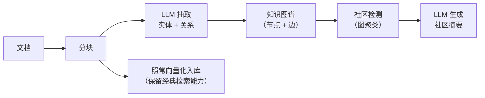
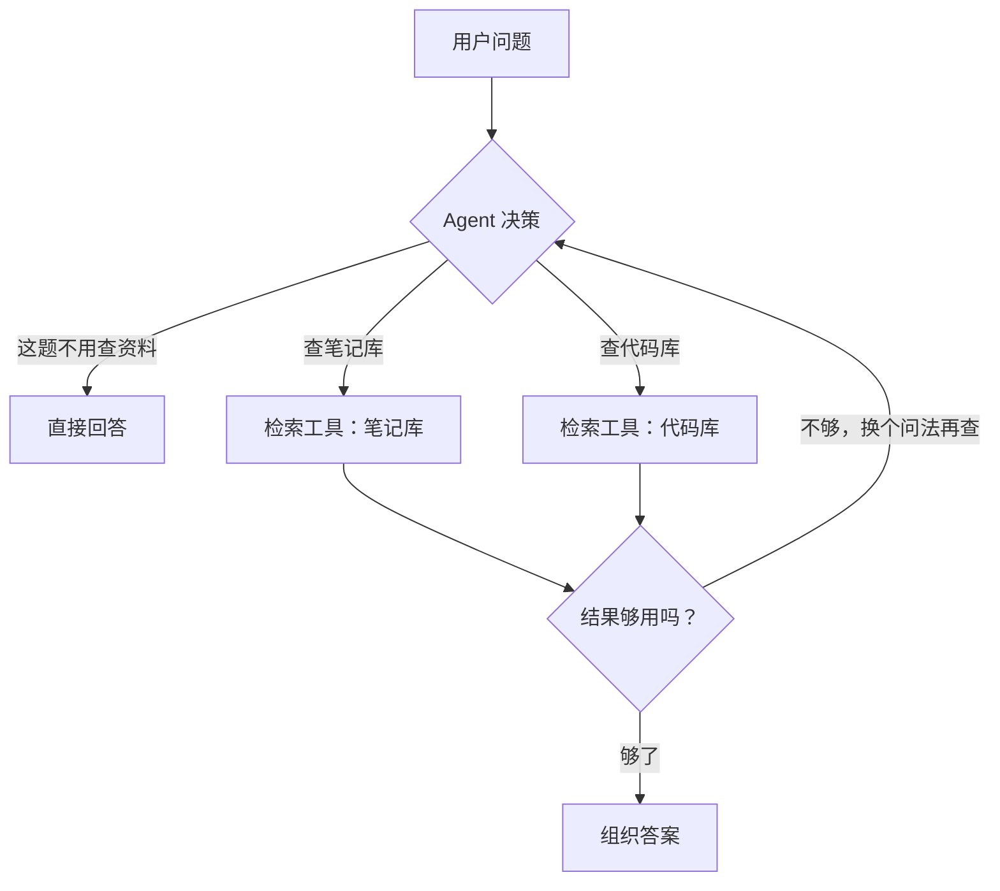
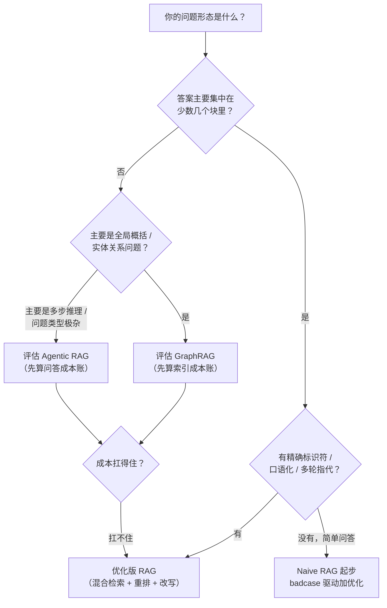

# 第 11 章 前沿形态：GraphRAG、Agentic RAG 与选型收束

> 一句话总结：看清经典 RAG 的能力边界，了解 GraphRAG 与 Agentic RAG 两种前沿形态的思路与代价，建立完整的选型判断力。

## 经典 RAG 的两类盲区

前十章打磨的这套 RAG（分块、向量化、检索、生成）有个学名：经典 RAG 或 Naive/Advanced RAG 谱系。它对「答案集中在一两个块里」的问题战无不胜，但有两类问题天生答不好。

**盲区一：全局性问题。** 「我这些笔记整体在关注什么主题？」「这批工单反映出哪几类系统性问题？」这类问题的答案不藏在任何一个块里，而在所有块的整体之上。切块检索的世界观是「找局部最优的几块」，全局性问题需要的是「俯瞰全局」，检索那几步还没开始，范式就已经错了。

**盲区二：多跳推理。** 「张总负责的那个项目，合作方是哪家公司，那家公司什么时候成立的？」答案需要三跳：先找到「张总负责 X 项目」，再找到「X 项目的合作方是 Y 公司」，最后找到「Y 公司成立于某年」。每一跳都依赖上一跳的结果才能构造查询，而经典 RAG 的检索是一次性的：一个问题取向量，一次召回。块①里没有「合作方」的字样，第一次检索就断了链子。

这两类盲区催生了 RAG 的两个重要变体，各自补一个。

## GraphRAG：让知识结成网

**GraphRAG** 的思路（以微软研究院 2024 年公开的方案为代表）：不只把文档切成孤立的块，而是让 LLM 通读文档，抽出**实体**（人、公司、概念）和**关系**（负责、合作、成立），构建一张知识图谱，实体是节点，关系是边。它的索引期因此比经典 RAG 重得多：



注意最后一支：原始块的向量索引依然保留。GraphRAG 是「经典检索 + 图谱层」的叠加，不是推翻重来。查询也相应分两种模式：**局部搜索**（Local Search）回答关于具体实体的问题，沿图谱找到实体及其关系网，再结合原文块作答；**全局搜索**（Global Search）回答俯瞰性问题，基于预生成的社区摘要综合。一套系统两种查询入口，按问题形态路由。

抽取出来的东西长这样（从「星链计划由张总牵头，与远航科技联合开发」这句话）：

```text
实体：张总（人物）、星链计划（项目）、远航科技（公司）
关系：张总 —[牵头]→ 星链计划
关系：星链计划 —[联合开发]→ 远航科技
```

文档里散落在十几处的「张总」「星链计划」，在图谱里汇成同一个节点，这就是「沿边多跳」的物质基础：实体把块和块缝在了一起。

有了图谱，两个新能力就长出来了：

**社区摘要补全局**。图谱天然形成聚落（某几个主题的实体纠缠在一起，称为社区）。索引期让 LLM 给每个社区生成一份摘要，预存起来。全局性问题来了，不再检索原始块，而是基于这些预生成的社区摘要综合回答，「这些文档整体在讨论什么」就有了答案来源。

**沿边多跳补推理**。实体之间的关系边把孤立的块连成了网：从「张总」这个节点出发，沿「负责」走到项目，沿「合作」走到公司，多跳问题变成图上的遍历。

插一句容易混淆的：GraphRAG 和后面要讲的 Agentic RAG 都能解多跳推理，但路子完全不同。GraphRAG 在**索引期**把关系抽出来固化成图，查询时沿现成的边走，功夫下在建库时；Agentic RAG 在**查询期**靠 LLM 现场决策多查几轮，功夫下在问答时。关系结构稳定、关系型问题多的语料，前者的账更划算；问题形态发散、没法预先抽取的，后者更灵活。

代价必须说透，而且不低。粗算一笔账：一份 10 万字的文档库，切成约 200 块，每块一次实体关系抽取（约 2000 token 输入 + 500 token 输出），社区检测后假设 20 个社区各生成一份摘要。索引期的 LLM 调用就是 200 多次抽取加 20 次摘要。按主流 API 价格估，一次建库几十到几百元，是经典 RAG 纯 Embedding 索引成本的几十倍，文档更新还要增量重跑。工程复杂度也上了一个台阶：图谱存储、增量更新、抽取质量控制（LLM 抽错实体怎么办），每一项都是新课题。

一句话定位：GraphRAG 是「全局性、关系性问题占比高」时的升级选项，不是经典 RAG 的替代品。个人笔记助手这种「查具体知识点」为主的场景，用它就是拿牛刀杀鸡，这也是我们实战项目不选它的原因。

## Agentic RAG：给检索装一个会思考的大脑

**Agentic RAG** 补的是另一块：检索过程本身的智能化。经典 RAG 的链路是写死的流水线：改写、召回、重排、生成，每个问题走一模一样的流程。Agentic RAG 把 LLM 放进决策回路里，让它**根据中间结果决定下一步动作**：



三种典型能力，每一种你都见过雏形：

**路由**：Agent 判断「这个问题该不该检索、该查哪个库」。「你好」不查库直接回；「pgvector 怎么建索引」查技术笔记；「报销找谁」查制度库。第 6 章的「无历史不改写」是这个思想的极简版：在动作之前先问「有必要吗」。

**多步检索**：查完一轮看结果，不够就换问法再查、换库再查，直到材料足够或确认没有。第 6 章的子查询分解是它的单轮版，Agentic 形态把「分解 → 检索 → 评估 → 再检索」放进了循环。

**工具化检索**：检索本身成为 Agent 可以调用的一个工具，和计算器、数据库查询、API 调用并列。Agent 在解决问题时自主决定何时检索、检索什么。

看一个多步检索的完整轨迹，感受它和经典流水线的差别。问题：「张总负责的那个项目，合作方什么时候成立的？」

```text
第 1 步  Agent 思考：先确认「张总负责的项目」是什么
        动作：检索「张总 负责 项目」
        观察：命中「星链计划由张总牵头」
第 2 步  Agent 思考：项目确认了，查它的合作方
        动作：检索「星链计划 合作方」
        观察：命中「星链计划与远航科技联合开发」
第 3 步  Agent 思考：最后查远航科技的成立时间
        动作：检索「远航科技 成立」
        观察：命中「远航科技成立于 2019 年」
第 4 步  Agent 思考：三跳齐了，组织答案
        输出：张总负责的星链计划，合作方远航科技成立于 2019 年。
```

注意每一步的查询都依赖上一步的观察，这正是经典 RAG「一次检索定终身」断链的地方，也是 Agentic 形态的核心价值。代价同样写在轨迹里：4 步就是 4 轮 LLM 决策加 3 次检索，时延和费用都是经典形态的好几倍，而且第 1 步如果检索错了项目，后面全跟着错，错误会沿链路放大。

这个形态和 Agent 框架（ReAct 模式、LangGraph 这类图编排）深度绑定，实现复杂度、调试难度、每次问答的 LLM 调用次数都显著上升。它的适用信号是：问题类型多样到单一路由写不死（一个系统要同时应付闲聊、事实查询、跨库综合、多步推理），且你能接受每次问答几倍于经典 RAG 的成本和时延。本课不展开实现——上一门《LangChain + LangGraph》课把 Agent 编排讲透了，那里是深入这个话题的正确入口。

上 Agentic 之前，还要想清楚它的三种典型死法。**决策错误累积**：十步链路、每步 90% 正确，全对概率只有 0.9¹⁰≈35%。步数越多，整体越不靠谱，必须在关键步骤设校验。**循环跑飞**：「结果不够 → 再查一次 → 还是不够 → 再查……」，没有最大步数保护的 Agent 能把你的额度烧穿，任何 Agent 系统的第一条纪律都是给循环设硬上限。**过程不可观测**：流水线出错看日志就完了，Agent 出错要复盘的是一串「它当时为什么这么决策」，没有 trace 工具（记录每步的思考、动作、观察），调试就是算命。这三条死法的共同解药还是第 10 章那套：评估集、归因、回归，只是评估对象从「答案」扩展到了「决策轨迹」。

## 变体不止这两个

GraphRAG 和 Agentic RAG 是声量最大的两个方向，但 RAG 的变体家族远不止它们。再认识两个常在论文和面试里出现的：

**Self-RAG（自反思 RAG）**：让模型在生成过程中自我评估——「现在需要检索吗」「检索到的内容相关吗」「我的答案忠于资料吗」，每一步都给自己打分再决定下一步。思路是把第 9、10 章的外部校验内置到模型的生成过程里。

**CRAG（Corrective RAG，纠错式 RAG）**：在检索之后加一道「检索质量评估」闸口——评估结果置信度低时，触发纠正动作（换问法重查、联网搜索补充），而不是把烂检索结果直接交给生成。你可以把它看成第 8 章阈值思路的激进版：不只拒答，还主动自救。

这些变体共享同一个直觉：经典流水线是「开环」的，问题进来、答案出去，中间没有审视；前沿形态们都在给链路装「闭环」：评估、反思、纠正、再试。记住这个共同直觉，再看到任何新冒出来的 RAG 变体论文，你都能在五分钟内看懂它补的是哪个环节。

## 形态光谱：从 Naive 到 Agentic

把五种形态放在一张表上，它们的关系就清楚了：

| 形态 | 一句话 | 每次问答成本 | 索引成本 | 适用 |
| --- | --- | --- | --- | --- |
| Naive RAG | 向量检索 + 拼接生成 | 1× | 低 | 原型验证、小语料 |
| 优化版 RAG（本课主线） | +改写/混合/重排/引用/拒答 | 1.5–3× | 低 | 绝大多数生产知识库 |
| 模块化 RAG | 检索器、重排器、路由全可插拔 | 视组合 | 中 | 多业务线共用一套底座 |
| GraphRAG | 知识图谱 + 社区摘要 | 2–5× | 极高（几十倍） | 全局性、关系性问题为主 |
| Agentic RAG | LLM 在回路里决策检索动作 | 3–10× | 中 | 问题类型极杂、多步推理多 |

从左到右，能力上限在涨，成本和复杂度涨得更快。注意一个反直觉的事实：**绝大多数生产系统停留在第二档**——优化版经典 RAG 配上评估迭代，已经能覆盖八九成的业务问答需求。后面三档是为特定问题形态准备的手术刀，不是普适的升级路线。

## 选型决策树



三个附加判断，比树本身还重要。第一，从左边起步：先 Naive 跑通，用第 10 章的评估集找出真实 badcase，badcase 指到哪就优化到哪，你没有义务一步到位。第二，成本账先算：GraphRAG 的索引成本、Agentic 的问答成本，用你自己的文档量和 QPS 估一遍再谈架构。第三，团队能力也是约束：Agentic 系统的调试难度远超经典 RAG，没有评估体系和可观测手段打底，上了也驾驭不住。

## 全课知识地图：到这里为止你拥有了什么

第 1 章提出的三个硬伤，现在可以逐一销账了。

**幻觉**：被四层工事围剿：检索让答案有资料兜底（2）、引用溯源让答案可检查（9）、双防线拒答让系统不硬答（9）、忠实度评估让残留幻觉可测量（10）。

**时效性**：索引期/查询期的分离让知识更新变成分钟级的增量操作（2），换 Embedding 模型要重建索引的纪律也讲清了（3）。

**私域知识**：从加载分块（4、13）到向量入库（5），你的文档有了完整的家。

按部件再看一遍这张地图，每一章都在链路上有一个坐标：

| 链路位置 | 部件 | 章节 |
| --- | --- | --- |
| 为什么做 | 三硬伤与三解法选型 | 1 |
| 索引期 | 加载与分块 | 4 |
| 索引期 | Embedding 与语义检索 | 3 |
| 索引期 | 向量存储与索引 | 5 |
| 查询期前段 | 查询理解与改写 | 6 |
| 查询期中段 | 混合检索与融合 | 7 |
| 查询期中段 | 重排精判 | 8 |
| 查询期后段 | 组装、引用、拒答、流式 | 9 |
| 贯穿全程 | 评估与迭代 | 10 |
| 形态选型 | 前沿变体与决策 | 11 |

方法论层面，你拿到了两条工作方式：每个部件都先手写一遍再谈框架（2、5、7、8 章的共同姿势）；一切优化以评估集和 badcase 为准绳（10）。

## 实战预告：个人笔记助手

模块三就是把这张地图变成真东西。项目是「个人笔记助手」：导入你的 Markdown / PDF / TXT 笔记，自动分块向量化，然后像聊天一样问它们问题：流式回答、标注出处、查不到就直说。

技术形态上，它严格落在「优化版经典 RAG」这一档，不是因为我们只会这个，而是这个场景就该用它：答案集中在少数块里、查询以自然语言为主、个人量级的成本敏感。模块二里没进项目的招式——混合检索、重排、GraphRAG——会在第 16 章复盘时作为「什么信号出现就该升级」的扩展点逐个回收。你学完会清楚地知道：现在的架构为什么够用，以及往哪个方向长大。

章节安排（每章一个可验收的里程碑）：

| 章节 | 里程碑 | 用到的前置章节 |
| --- | --- | --- |
| 12 项目导览 | 骨架可运行，前后端联通 | 全局 |
| 13 导入流水线 | 三种格式上传后自动入库 | 3、4、5 |
| 14 问答 API | 多轮、流式、引用、拒答全通 | 6、8、9 |
| 15 前端实现 | 文档管理与对话界面可用 | 14 |
| 16 联调部署 | Docker 一键部署 + 复盘 | 7、10、11（扩展点回收） |

## 常见误区

**误区一：新的就是好的。** GraphRAG 和 Agentic RAG 解决的是特定盲区，不是全面超越。在「查具体知识点」的主场，它们成本更高，效果未必更好。举个具体的：问「pgvector 的 HNSW 索引怎么建」，经典 RAG 一次检索命中教程块，两秒出答案；Agentic 形态决策三轮、检索两次，十五秒后给出同样的答案。问题没变难，只是路变贵了。

**误区二：形态可以叠加，所以全都要。** 「GraphRAG 打底 + Agentic 调度 + 混合检索 + 重排」听起来很美好，实际是四份成本、四个故障域、一套没人调得动的复杂度。每加一层，都要用第 10 章的方法证明它带来的提升大过它的代价。架构的品味，体现在你拒绝了什么。

**误区三：Agentic RAG 等于更聪明。** Agent 的每一步决策都可能出错，步数越多错误越累积。没有评估体系兜底的 Agentic 系统，常常表现为「偶尔惊艳，经常离谱」。

**误区四：跳过基本功直接上高级形态。** 分块没切好、Embedding 没选对、评估集没有，这时候上 GraphRAG，等于在沙地上盖楼。前十章的基本功，是所有形态的共同地基。

## 小结与自测

本章是模块二的收束：经典 RAG 的两类盲区（全局性、多跳推理）；GraphRAG 的图谱与社区摘要思路及其惊人的索引成本；Agentic RAG 的决策回路及其问答成本；五档形态光谱与「大多数系统停在第二档」的行业现实；从 badcase 出发、先算成本账的选型纪律。

自测：

1. 「帮我总结这批文档的整体趋势」为什么经典 RAG 答不好？GraphRAG 用什么机制补上？
2. 多跳推理断链的具体位置在哪一环？Agentic RAG 的多步检索如何修复？
3. 一个 500 篇文档、日活 50 人的内部知识库，老板提议上 GraphRAG，你拿什么数据劝他（或支持他）？
4. 为什么说「大多数生产系统停在优化版 RAG 这一档」？从成本和问题分布两个角度解释。
5. 个人笔记助手为什么不选 Agentic RAG？什么信号出现时应该重新考虑？

模块二收官。从下一章开始，键盘敲出火星。个人笔记助手，从零到上线，五章见真章。
