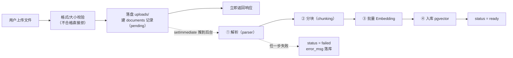

# 第 13 章 文档导入流水线：多格式解析、分块与向量化入库

> 一句话总结：实现上传后自动完成「解析 → 分块 → 向量化 → 入库」的异步流水线，三种格式全部落地，状态机全程可见。

## 流水线全景

本章交付里程碑 1：用户上传一份文档，不用等，系统后台自动把它变成一堆可检索的向量，状态标签从「待处理」走到「就绪」。



这一章把索引期从「第 2 章的手动实验」升级为「工业流水线」。四个处理步骤你在原理章都见过，本章的新课题是工程问题：异步、状态、失败处理、格式扩展。

## 上传接口：为什么必须异步

先算时间账。一份 500KB 的 PDF，解析 1 秒、分块忽略不计、向量化 200 个块分 4 批调 API 约 8 秒——总共 10 秒上下。如果上传接口同步做完这一切，用户盯着转圈 10 秒，HTTP 超时风险、并发一上来连接全被占着。正确姿势是**上传即返回，处理走后台**：接口只负责收文件、建记录，几毫秒返回；重活推给后台流水线，前端靠轮询状态标签跟进进度。

用 multer 处理 multipart 上传（`src/routes/documents.ts`）：

```bash
npm install multer pdf-parse openai
```

```ts
import { Router } from "express";
import multer from "multer";
import { unlink } from "node:fs/promises";
import { createDocument, listDocuments, deleteDocument } from "../repositories/documents.js";
import { kickoffIngest } from "../services/ingest.js";

export const documentsRouter = Router();

// 上传约束：10MB 上限、只收 md/pdf/txt、落盘 uploads/
const ALLOWED = new Set(["md", "pdf", "txt"]);
const upload = multer({
  dest: "uploads/",
  limits: { fileSize: 10 * 1024 * 1024 },
});

documentsRouter.post("/documents", upload.single("file"), async (req, res) => {
  if (!req.file) return res.status(400).json({ error: "缺少文件字段 file" });

  const ext = req.file.originalname.split(".").pop()?.toLowerCase() ?? "";
  if (!ALLOWED.has(ext)) {
    await unlink(req.file.path); // 不支持的格式，落盘的文件也要清掉
    return res.status(400).json({ error: `不支持的格式 .${ext}，仅支持 md / pdf / txt` });
  }

  const doc = await createDocument({
    filename: req.file.originalname,
    format: ext,
    sizeBytes: req.file.size,
  });

  // 上传即返回 pending，解析分块向量化推到后台流水线
  kickoffIngest(doc.id, ext, req.file.path);
  res.status(201).json(doc);
});

documentsRouter.get("/documents", async (_req, res) => {
  res.json(await listDocuments());
});

documentsRouter.delete("/documents/:id", async (req, res) => {
  const id = Number(req.params.id);
  if (!Number.isInteger(id)) return res.status(400).json({ error: "id 必须是整数" });
  await deleteDocument(id); // 外键级联删除 chunks
  res.json({ ok: true });
});
```

三个细节值得停留。第一，`upload.single("file")` 里的 `"file"` 是表单字段名，前端上传时要对得上（第 15 章会写）。第二，格式拒绝后那个 `unlink` 别漏——multer 先落盘才轮到你的校验逻辑，不合格的文件不删就是垃圾堆积。第三，按扩展名判断格式是务实简化（MIME 类型可以伪造），个人应用够用；更严格的场景要读文件头魔数。

## 解析器：一个接口，三个实现

第 4 章说过「PDF 的瓶颈常常在解析不在分块」。现在直面三种格式的差异，统一抽象成一个接口（`src/parsers/types.ts`）：

```ts
// 所有解析器的统一输出：按文档自然结构切开的节 + 结构信息
export interface ParsedDoc {
  sections: { heading: string | null; text: string }[];
}

// 解析器统一接口：新增格式 = 新增一个实现（开闭原则）
export interface Parser {
  format: string;
  parse(filePath: string): Promise<ParsedDoc>;
}
```

这个接口是开闭原则的实际应用：流水线只认识 `Parser`，以后加 Word、加 HTML，新增一个实现类注册进来，流水线一行不改。`heading` 字段就是第 4 章埋的元数据伏笔——「这块属于哪个标题」，能拿到就记下，拿不到（PDF、TXT）就是 null。

**Markdown 解析器**（`src/parsers/markdown.ts`）：按标题层级切节，结构化切分的落地：

```ts
import { readFile } from "node:fs/promises";
import type { Parser, ParsedDoc } from "./types.js";

// Markdown 解析：按标题层级切节，保留「这节属于哪个标题」的结构信息
export const markdownParser: Parser = {
  format: "md",
  async parse(filePath) {
    const raw = await readFile(filePath, "utf8");
    const sections: ParsedDoc["sections"] = [];
    let heading: string | null = null;
    let buffer: string[] = [];

    const flush = () => {
      const text = buffer.join("\n").trim();
      if (text) sections.push({ heading, text });
      buffer = [];
    };

    for (const line of raw.split("\n")) {
      const m = line.match(/^#{1,3}\s+(.+)/); // 一到三级标题都算节边界
      if (m) {
        flush();
        heading = m[1].trim();
      } else {
        buffer.push(line);
      }
    }
    flush();
    return { sections };
  },
};
```

`flush` 函数是「遇边界就封节」的通用模式：遍历中行缓冲内容，遇到标题先把攒下的内容封成一节，再开新节。一到三级标题都算边界，正文前的内容归入 `heading: null` 的第一节。

**PDF 解析器**（`src/parsers/pdf.ts`）：用 pdf-parse 提取文本。版本注意：本课用的是 pdf-parse v2（2026-07-29 实测 2.4.5），API 和网上大量 v1 教程完全不同——v1 是 `pdf(buffer)` 函数调用，v2 是 `PDFParse` 类：

```ts
import { readFile } from "node:fs/promises";
import { PDFParse } from "pdf-parse";
import type { Parser, ParsedDoc } from "./types.js";

// PDF 解析：pdf-parse v2 提取全文，按「连续空行」粗分节
// 注意：PDF 没有可靠的结构信息，提取文本可能带页码、Unicode 兼容字符等噪声
export const pdfParser: Parser = {
  format: "pdf",
  async parse(filePath) {
    const buf = await readFile(filePath);
    const parser = new PDFParse({ data: buf });
    const result = await parser.getText();
    await parser.destroy();

    const text = result.text.replace(/--\s*\d+\s*of\s*\d+\s*--/g, ""); // 去掉页码噪声
    if (!text.trim()) {
      throw new Error("PDF 未提取到文本，可能是扫描件（本系统暂不支持 OCR）");
    }
    const sections = text
      .split(/\n\s*\n/)
      .map((t) => t.trim())
      .filter(Boolean)
      .map((t) => ({ heading: null, text: t }));
    return { sections };
  },
};
```

实测提取的文本长这样，注意里面的两种噪声：

```text
pgvector HNSW 索引实战笔记
HNSW 是多层图索引，查询快召回⾼。        ← 「⾼」是 Unicode 兼容字符（U+2FCF），不是常用字
建索引⽤ vector_cosine_ops 配套余弦距离。

-- 1 of 1 --                              ← 页码噪声，正则清掉
```

提取为空说明是扫描件（图片型 PDF，没有文本层），抛出明确错误——需求边界里写了不做 OCR，那就让失败原因说清楚，而不是默默入库一堆空块。Unicode 兼容字符那类噪声（字体映射导致），个人笔记场景影响有限，检索时 Embedding 模型对它们有一定容忍度；真正较真的场景要做 Unicode NFKC 归一化，第 16 章排错清单里有它的位置。

**TXT 解析器**（`src/parsers/txt.ts`）最简单，按空行分段：

```ts
import { readFile } from "node:fs/promises";
import type { Parser, ParsedDoc } from "./types.js";

export const txtParser: Parser = {
  format: "txt",
  async parse(filePath) {
    const raw = await readFile(filePath, "utf8");
    const sections = raw
      .split(/\n\s*\n/)
      .map((t) => t.trim())
      .filter(Boolean)
      .map((t) => ({ heading: null, text: t }));
    return { sections };
  },
};
```

最后是注册表（`src/parsers/index.ts`），流水线通过它按格式找解析器：

```ts
import type { Parser } from "./types.js";
import { markdownParser } from "./markdown.js";
import { pdfParser } from "./pdf.js";
import { txtParser } from "./txt.js";

const parsers: Record<string, Parser> = { md: markdownParser, pdf: pdfParser, txt: txtParser };

export function getParser(format: string): Parser {
  const p = parsers[format];
  if (!p) throw new Error(`不支持的格式: ${format}（支持 md / pdf / txt）`);
  return p;
}
```

## 分块：兑现 overlap 承诺

第 4 章的 recursiveSplit 当时故意没实现 overlap，说好了项目里补。补全版（`src/chunking.ts`），改动在封块的那几行：

```ts
export interface ChunkInput {
  heading: string | null;
  content: string;
}

// 递归分块（第 4 章的完整版：这次带 overlap）
export function recursiveSplit(
  text: string,
  chunkSize: number,
  overlap: number,
  separators = ["\n\n", "\n", "。", "？", "！", ""]
): string[] {
  if (text.length <= chunkSize) return [text];
  const sep = separators[0];
  const rest = separators.slice(1);
  const pieces = sep === "" ? [...text] : text.split(sep);

  const chunks: string[] = [];
  let current = "";

  for (const piece of pieces) {
    if (piece === "") continue;          // split 会在首尾留下空串，跳过防止产生垃圾块
    const unit = sep === "" ? piece : piece + sep;
    if ((current + unit).length <= chunkSize) {
      current += unit;
    } else {
      if (current) chunks.push(current);
      if (unit.length > chunkSize) {
        // 单个小片就超标：降级，用更细的分隔符递归切
        chunks.push(...recursiveSplit(unit, chunkSize, overlap, rest));
        current = "";
      } else {
        // overlap：下一块从上一块结尾的 overlap 个字符起步
        current = overlap > 0 && current.length > overlap
          ? current.slice(-overlap) + unit
          : unit;
      }
    }
  }
  if (current) chunks.push(current);
  return chunks;
}

// 对解析出的每个节分别分块，保留 heading 元数据
export function chunkSections(
  sections: { heading: string | null; text: string }[],
  chunkSize = 400,
  overlap = 60
): ChunkInput[] {
  const out: ChunkInput[] = [];
  for (const sec of sections) {
    for (const content of recursiveSplit(sec.text, chunkSize, overlap)) {
      out.push({ heading: sec.heading, content });
    }
  }
  return out;
}
```

overlap 的实现就一行核心：封块后，`current` 不从空白起步，而是从上一块结尾的 60 个字符起步。实测验证（三段各 100 字、chunkSize 150、overlap 30）：

```text
#0 len=102  head: 第一段甲甲甲甲甲  tail: 甲甲甲甲甲甲
#1 len=132  head: 甲甲甲甲甲甲甲甲  tail: 乙乙乙乙乙乙   ← 开头带着 #0 的尾巴
#2 len=132  head: 乙乙乙乙乙乙乙乙  tail: 丙丙丙丙丙丙   ← 开头带着 #1 的尾巴
```

块大小定 400、overlap 60（15%），是第 4 章「中文制度类 300–500 字符 + 10–20% 重叠」经验值的直接取值。`chunkSections` 按节分块而不是全文一刀切——节是语义单元，块不跨节，heading 元数据也随块保留下来。

## LLM 客户端与批量 Embedding

`src/core/llm.ts` 是供应商可插拔设计的落点：所有模型调用收敛到这一个文件，换供应商只改 `.env`。

```ts
import OpenAI from "openai";
import { config } from "./config.js";

// 聊天模型客户端（OpenAI 兼容协议，换供应商只改 .env）
export const llm = new OpenAI({
  apiKey: config.llm.apiKey,
  baseURL: config.llm.baseUrl,
});

// Embedding 客户端：允许和聊天模型指向不同供应商（混搭是常态）
export const embedder = new OpenAI({
  apiKey: config.embedding.apiKey,
  baseURL: config.embedding.baseUrl,
});

// 批量向量化：每批 64 段，避免单次请求过大
export async function embedBatch(texts: string[]): Promise<number[][]> {
  const BATCH = 64;
  const out: number[][] = [];
  for (let i = 0; i < texts.length; i += BATCH) {
    const batch = texts.slice(i, i + BATCH);
    const resp = await embedder.embeddings.create({
      model: config.embedding.model,
      input: batch,
      dimensions: config.embedding.dim,
    });
    out.push(...resp.data.map((d) => d.embedding));
  }
  return out;
}
```

三个设计点。`llm` 和 `embedder` 是两个独立客户端——第 2 章说过供应商混搭是常态（聊天用 A 家、Embedding 用 B 家），配置分开才有这个自由。批大小 64 是经验值：再大，单请求容易触达 API 的输入上限；再小，请求次数膨胀，免费档的频率限制吃不消。`dimensions` 显式传配置的维度，和启动时的维度校验形成闭环。

没有加重试逻辑，是刻意留白：Embedding 调用失败时整个文档标记 failed，重传即重试，对个人应用够用。生产环境该给网络调用加指数退避重试（第一次等 1 秒、第二次 2 秒、第三次 4 秒），第 16 章测试清单会把它列为加固项。

## 流水线与状态机

全部零件就位，组装流水线（`src/services/ingest.ts`）：

```ts
import { getParser } from "../parsers/index.js";
import { chunkSections } from "../chunking.js";
import { embedBatch } from "../core/llm.js";
import { updateDocStatus, insertChunks } from "../repositories/documents.js";

// 导入流水线：解析 → 分块 → 向量化 → 入库，全程驱动文档状态机
export async function ingestDocument(docId: number, format: string, filePath: string) {
  try {
    await updateDocStatus(docId, "processing");

    // ① 解析：格式差异被解析器挡在这一步，下游只见统一的 sections
    const parsed = await getParser(format).parse(filePath);

    // ② 分块：递归切分 + overlap，保留 heading 元数据
    const blocks = chunkSections(parsed.sections, 400, 60);
    if (blocks.length === 0) throw new Error("文档内容为空");

    // ③ 向量化：批量调用 Embedding
    const vectors = await embedBatch(blocks.map((b) => b.content));

    // ④ 入库：块和向量一起落 pgvector
    await insertChunks(
      blocks.map((b, i) => ({
        documentId: docId,
        seq: i,
        heading: b.heading,
        content: b.content,
        tokenCount: b.content.length, // 中文按字符数近似 token（第 4 章的换算约定）
        embedding: vectors[i],
      }))
    );

    await updateDocStatus(docId, "ready");
    console.log(`[ingest] 文档 ${docId} 处理完成：${blocks.length} 块`);
  } catch (err) {
    await updateDocStatus(docId, "failed", err instanceof Error ? err.message : String(err));
    console.error(`[ingest] 文档 ${docId} 处理失败:`, err);
  }
}

// 上传接口拿到响应后立即返回，流水线用 setImmediate 推到后台执行
export function kickoffIngest(docId: number, format: string, filePath: string) {
  setImmediate(() => void ingestDocument(docId, format, filePath));
}

// 崩溃恢复：服务重启时，把卡在 processing 的文档退回 pending 等人工重传
export async function recoverStuckDocs() {
  await pool.query("UPDATE documents SET status = 'pending', updated_at = now() WHERE status = 'processing'");
}
```

读这条流水线的三个工程决策。

**setImmediate 是什么角色。** 它把 `ingestDocument` 推到 Node 事件循环的下一个 tick 执行——上传响应先飞回去，流水线随后开跑，两者互不阻塞。这就是「进程内异步任务」的最小实现：没有队列、没有 worker，靠状态机落库保证进度可追踪。它的短板也明显：服务一崩，正在 processing 的任务就丢了。所以 `recoverStuckDocs` 在启动时把卡在 processing 的记录退回 pending，用户重传即可。生产环境的正解是任务队列（BullMQ + Redis：任务持久化、失败重试、并发控制全套），第 16 章复盘会指出这个升级点——现在，先让你看清「为什么需要队列」这个问题本身。

**失败不落盘等于没发生。** `catch` 里把错误消息写进 `error_msg`，用户在文档列表里能看到「PDF 未提取到文本，可能是扫描件」这样的具体原因，而不是一个干巴巴的「失败」。排错的成本，在设计状态机时就该想好。

**入库前没有事务包裹。** 严格说，chunks 插入和状态更新应该是原子的。个人应用里失败重传的代价足够低，从简；这也是第 16 章的加固项之一。

仓储层（`src/repositories/documents.ts`）负责全部 SQL，其中列表查询顺带统计每个文档的块数：

```ts
import { eq, desc, count } from "drizzle-orm";
import { db } from "../core/db.js";
import { documents, chunks } from "../models/schema.js";

export async function createDocument(data: { filename: string; format: string; sizeBytes: number }) {
  const [row] = await db.insert(documents).values(data).returning();
  return row;
}

export async function listDocuments() {
  return db
    .select({
      id: documents.id,
      filename: documents.filename,
      format: documents.format,
      sizeBytes: documents.sizeBytes,
      status: documents.status,
      errorMsg: documents.errorMsg,
      createdAt: documents.createdAt,
      chunkCount: count(chunks.id),
    })
    .from(documents)
    .leftJoin(chunks, eq(chunks.documentId, documents.id))
    .groupBy(documents.id)
    .orderBy(desc(documents.createdAt));
}

export async function updateDocStatus(
  id: number,
  status: "pending" | "processing" | "ready" | "failed",
  errorMsg?: string
) {
  await db.update(documents)
    .set({ status, errorMsg: errorMsg ?? null, updatedAt: new Date() })
    .where(eq(documents.id, id));
}

export async function deleteDocument(id: number) {
  // 外键级联：chunks 跟着删除，向量同步消失
  await db.delete(documents).where(eq(documents.id, id));
}

export async function insertChunks(rows: {
  documentId: number; seq: number; heading: string | null;
  content: string; tokenCount: number; embedding: number[];
}[]) {
  if (rows.length === 0) return;
  await db.insert(chunks).values(rows); // drizzle 的 vector 字段直接收 number[]
}
```

别忘了在 `src/index.ts` 挂上文档路由，并在启动时跑崩溃恢复：

```ts
import { documentsRouter } from "./routes/documents.js";
// ……
app.use("/api", documentsRouter);
```

## 里程碑 1 验收：三种格式全走一遍

后端跑着，准备三份测试文件（一份带标题层级的 Markdown 笔记、一份 TXT、一份用任意方式导出的 PDF），连续上传：

```bash
curl -F "file=@test-note.md" http://localhost:8000/api/documents
curl -F "file=@test-doc.txt" http://localhost:8000/api/documents
curl -F "file=@test-doc.pdf" http://localhost:8000/api/documents
curl -F "file=@bad.exe" http://localhost:8000/api/documents   # 顺手验证格式拒绝
```

上传接口毫秒级返回 `pending`（实测输出）：

```json
{"id":1,"filename":"test-note.md","format":"md","status":"pending",...}
{"error":"不支持的格式 .exe，仅支持 md / pdf / txt"}
```

几秒后查列表，状态全部走到 `ready`，块数符合预期：

```json
[
  {"id":3,"filename":"test-doc.pdf","status":"ready","chunkCount":1,...},
  {"id":2,"filename":"test-doc.txt","status":"ready","chunkCount":2,...},
  {"id":1,"filename":"test-note.md","status":"ready","chunkCount":3,...}
]
```

最关键的一步：进数据库亲眼看看块和向量（这一步不要省，「接口说成功了」和「数据真的对」是两回事）：

```sql
SELECT document_id, seq, heading, left(content, 20) AS preview, vector_dims(embedding) AS dims
FROM chunks ORDER BY document_id, seq;
```

```text
 document_id | seq |   heading   |        preview         | dims
-------------+-----+-------------+------------------------+------
           1 |   0 | 索引类型    | HNSW 是多层图索引……    | 1024
           1 |   1 | 距离操作符  | 余弦距离用 <=>……       | 1024
           1 |   2 | 实战心得    | 维度不匹配的报错信息…… | 1024
           2 |   0 |             | pgvector HNSW 索引……   | 1024
           2 |   1 |             | HNSW 是多层图索引……    | 1024
           3 |   0 |             | pgvector HNSW 索引……   | 1024
```

Markdown 的三个块带着正确的 heading（解析器按标题切节的成果），向量维度 1024 与配置一致。再验证级联删除：`curl -X DELETE http://localhost:8000/api/documents/1`，然后查 `SELECT count(*) FROM chunks WHERE document_id = 1;`——归零，向量跟着文档一起消失。F1、F2 功能的后端部分，全部落地。

## 常见坑位清单

- **上传成功但永远 pending**：流水线抛错被打日志吞了。先查 `error_msg` 字段，再看后端控制台。状态机设计的意义就在这——任务丢了，状态不会说谎。
- **PDF 提取为空**：扫描件。本系统按需求边界报明确错误，想要 OCR 自己接 Tesseract 或云 OCR，那是另一个项目。
- **向量化报频率限制（429/1302）**：免费档限流。把 BATCH 调小、批间加 sleep，或换付费档。
- **重启后文档卡在 processing**：崩溃恢复没跑。确认 `recoverStuckDocs` 在启动路径上。
- **multer 落盘文件越来越多**：删除文档时 uploads/ 里的原文也要一起删——本章代码留了这个小尾巴，第 16 章收尾时处理（你能现在就修好它，是个不错的练习）。

## 小结与预告

本章把索引期工业化了：上传即返回的异步设计（setImmediate + 状态机 + 崩溃恢复）；解析器统一接口与开闭原则；带 overlap 的递归分块兑现；批量 Embedding 与供应商可插拔；pgvector 入库与级联删除。索引期四条动脉全部打通。

下一章是项目的心脏：问答 API。查询改写、向量检索、阈值拒答、Prompt 组装、SSE 流式、引用回传、对话历史落库——第 6、8、9 章的所有原理，合成一条端到端的链路。
