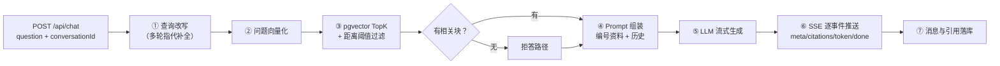

# 第 14 章 问答 API：语义检索、Prompt 组装与流式问答

> 一句话总结：实现「改写 → 检索 → 阈值拒答 → 组装 → 流式生成 → 引用回传 → 落库」的完整问答链路，多轮对话与 SSE 端到端可用。

## 链路总览：查询期的工业化

第 2 章你手写过一个 60 行的 naive RAG，本章是它的生产形态。同一个问题「我笔记里 pgvector 索引怎么建」，从进来到出去要走七个环节：



这一章的代码量是全项目最密集的，但每个环节的原理你都学过了：改写是第 6 章、检索是第 5 章、阈值是第 8 章、组装是第 9 章、流式是第 9 章的 SSE。本章的真正新课题只有一个：怎么把它们组织成一条边界清晰的服务端链路。

## 数据层：会话、消息与检索

先铺数据层（`src/repositories/chat.ts`）。会话和消息的 CRUD 没有新东西，注意三个设计点：`listConversations` 按 `updatedAt` 倒序（最近活跃的会话排最前，每次有新消息就戳一下这个时间戳）；`searchChunks` 就是第 5 章那条相似度 SQL 的原样搬进（`<=>` 余弦距离，越小越相似）；`getChunk` 联表查出块的原文和出处文件名，给引用溯源用。

```ts
import { eq, desc, asc } from "drizzle-orm";
import { db, pool } from "../core/db.js";
import { conversations, messages } from "../models/schema.js";

export async function createConversation(title = "新对话") {
  const [row] = await db.insert(conversations).values({ title }).returning();
  return row;
}

export async function listConversations() {
  return db.select().from(conversations).orderBy(desc(conversations.updatedAt));
}

export async function deleteConversation(id: number) {
  await db.delete(conversations).where(eq(conversations.id, id)); // 级联删 messages
}

export async function listMessages(conversationId: number) {
  return db.select().from(messages)
    .where(eq(messages.conversationId, conversationId))
    .orderBy(asc(messages.createdAt));
}

export async function addMessage(data: {
  conversationId: number; role: "user" | "assistant";
  content: string; citations?: number[];
}) {
  const [row] = await db.insert(messages).values({
    conversationId: data.conversationId,
    role: data.role,
    content: data.content,
    citations: data.citations ?? null,
  }).returning();
  // 更新会话的 updatedAt，让列表按最近活跃排序
  await db.update(conversations).set({ updatedAt: new Date() })
    .where(eq(conversations.id, data.conversationId));
  return row;
}

// 向量检索：TopK + 距离（cosine distance，越小越相似）
export async function searchChunks(queryVector: number[], topK: number) {
  const vec = `[${queryVector.join(",")}]`;
  const { rows } = await pool.query(
    `SELECT id, document_id, heading, content,
            embedding <=> $1 AS distance
     FROM chunks
     ORDER BY embedding <=> $1
     LIMIT $2`,
    [vec, topK]
  );
  return rows as { id: number; document_id: number; heading: string | null; content: string; distance: number }[];
}

// 引用溯源：按 chunk id 取原文与出处
export async function getChunk(id: number) {
  const { rows } = await pool.query(
    `SELECT c.id, c.content, c.heading, c.seq, d.filename AS doc_name
     FROM chunks c JOIN documents d ON d.id = c.document_id
     WHERE c.id = $1`,
    [id]
  );
  return rows[0] ?? null;
}
```

向量检索这条 SQL 走原生 `pool.query` 而不是 Drizzle 的查询构造器——第 5 章说过，`<=>` 这类向量操作符，手写 SQL 比 ORM 抽象直接得多。分层纪律没破：SQL 仍然只在 repository 层。

## 查询改写：第 6 章的生产版

多轮对话的指代消解，项目里的实现（`src/services/chat.ts`，分段讲解）：

```ts
import { llm, embedBatch } from "../core/llm.js";
import { config } from "../core/config.js";
import {
  addMessage, listMessages, searchChunks, createConversation,
} from "../repositories/chat.js";

const HISTORY_TURNS = 5;          // 近 5 轮原文进 Prompt
const TOP_K = 5;                  // 检索取 5 块
const DISTANCE_THRESHOLD = 0.6;   // 余弦距离阈值，超过视为不相关（调参点）

type HistoryMessage = { role: "user" | "assistant"; content: string };

// 查询改写（第 6 章）：有历史时把指代问题补全为自包含检索句
async function rewriteQuery(history: HistoryMessage[], question: string): Promise<string> {
  if (history.length === 0) return question; // 无历史不改写，省一次调用
  const historyText = history
    .map((m) => `${m.role === "user" ? "用户" : "助手"}：${m.content}`)
    .join("\n");
  const resp = await llm.chat.completions.create({
    model: config.llm.model,
    messages: [
      {
        role: "system",
        content:
          "你是查询改写器。根据对话历史，把用户的最新问题改写成一个不依赖上下文也能理解的完整问句。" +
          "保留专有名词和限定条件，不添加新意图。只输出改写后的问句，不要回答问题。",
      },
      { role: "user", content: `【对话历史】\n${historyText}\n\n【最新问题】\n${question}` },
    ],
  });
  return resp.choices[0].message.content!.trim();
}
```

和第 6 章实验版的差异就两处，都是生产化打磨：prompt 里补了「保留专有名词、不添加新意图」两条保真约束；历史从「外部传入」变成「从数据库读最近 5 轮」。`HISTORY_TURNS` 取 5 的道理第 6 章讲过：指代很少跨十几轮，塞更多历史只会让改写器抓不住重点。

## 阈值拒答：方向，方向，还是方向

检索和阈值过滤：

```ts
// ④ 阈值拒答（第 8/9 章：距离越小越相似，注意方向！）
const relevant = hits.filter((h) => h.distance <= DISTANCE_THRESHOLD);
const citations = relevant.map((h, i) => ({
  ref: i + 1,
  chunkId: h.id,
  heading: h.heading,
  snippet: h.content.slice(0, 80),
}));
yield { event: "citations", data: citations };
```

第 5 章强调过的方向问题在这里是实打实的 bug 温床：`<=>` 是**距离**，越小越相似，所以过滤条件是 `distance <= 阈值`。写成 `>=` 的，系统会把所有相关块扔掉、专留不相关的——而且测试时不一定立刻发现，因为链路照样跑、答案照样出（只是变烂）。阈值 0.6 是起步值，第 16 章用评估集实测调优。

拒答的实现不是「不回答」，而是换一条 Prompt 路径： citations 为空数组（前端据此可以不显示引用区），资料替换为一句「未检索到相关内容」，指令兜底让模型明说不知道：

```ts
// ⑤ 组装 Prompt（拒答路径：空资料 + 指令兜底）
const messages = relevant.length > 0
  ? buildMessages(relevant, history, question)
  : buildMessages([{ content: "（资料库中没有检索到相关内容）" }], history, question);
```

为什么拒答也走 LLM 而不是返回固定文案？第 9 章说过：让拒答语气自然（「这份资料里没找到 X，要不要补充相关笔记？」），且保持行为一致——「回答有资料的部分」这种部分拒答场景，本来就需要模型参与。

## Prompt 组装：生产版的 buildMessages

```ts
// Prompt 组装（第 9 章）：编号资料 + 引用规则 + 部分拒答约定
function buildMessages(chunks: { content: string }[], history: HistoryMessage[], question: string) {
  const context = chunks.map((c, i) => `[${i + 1}] ${c.content}`).join("\n\n");
  // 历史里的旧角标洗掉，防止模型混淆旧编号与本次编号
  const cleanHistory = history.map((m) => ({
    role: m.role as "user" | "assistant",
    content: m.content.replace(/\[\d+\]/g, ""),
  }));
  return [
    {
      role: "system" as const,
      content:
        "你是个人笔记助手。仅根据【资料】回答问题，规则：\n" +
        "1. 引用的事实句末标注 [n]（n 为资料编号）。\n" +
        "2. 资料不足时，回答有资料的部分，并说明哪些没有查到。\n" +
        "3. 完全没有相关资料时，明确说「根据现有资料无法回答」。\n\n" +
        `【资料】\n${context}`,
    },
    ...cleanHistory,
    { role: "user" as const, content: question },
  ];
}
```

第 9 章埋的「历史角标污染」伏笔在这里回收：历史消息里助手旧回答的 `[1]` `[2]` 是**上次检索**的编号，和本次资料编号是两码事，一行正则洗掉。漏了这一步的典型症状是：模型在新答案里引用一个本次资料里根本不存在的编号。

还有一个第 9 章 Token 预算的落地检查点。本章的预算分配是：5 块资料 × 平均 400 字符 ≈ 2000 token，历史 5 轮 × 约 200 字符 ≈ 1000 token，指令加问题几百 token——总量三千出头，离 glm-4.7-flash 的窗口远着呢。这就是第 9 章预算表在项目里的真实样子：不是算出来看的眼，而是「块数 × 块大小」「轮数 × 平均长度」这两组参数的直接产物。资料侧超预算时优先砍尾部块（相关度最低的），历史侧超预算时优先砍最早的轮次——两个「砍」都保住了质量最高的部分。

## SSE 路由：逐行解剖流式协议

路由层（`src/routes/chat.ts`）先把 SSE 的协议动作做全：

```ts
import { Router } from "express";
import { chat } from "../services/chat.js";
import {
  createConversation, listConversations, deleteConversation, listMessages, getChunk,
} from "../repositories/chat.js";

export const chatRouter = Router();

chatRouter.post("/chat", async (req, res) => {
  const { conversationId, question } = req.body ?? {};
  if (!question || typeof question !== "string") {
    return res.status(400).json({ error: "question 不能为空" });
  }

  // SSE 三件套响应头：事件流类型、禁缓存、保活
  res.writeHead(200, {
    "Content-Type": "text/event-stream",
    "Cache-Control": "no-cache",
    Connection: "keep-alive",
  });

  const send = (event: string, data: unknown) => {
    res.write(`event: ${event}\ndata: ${JSON.stringify(data)}\n\n`);
  };

  try {
    for await (const ev of chat(question, conversationId)) {
      send(ev.event, ev.data);
    }
  } catch (err) {
    send("error", { message: err instanceof Error ? err.message : "服务器错误" });
  } finally {
    res.end();
  }
});
```

逐行拆解这个协议。`Content-Type: text/event-stream` 告诉客户端「这个响应不会一次性结束，准备持续收事件」；`Cache-Control: no-cache` 防中间层缓存；响应体里每个事件是四行结构——`event: 事件名`、`data: JSON`、`空行`（空行是事件的分隔符，漏了客户端就解析不出来）。`res.write` 写一块就立即发一块，`res.end()` 才收尾。

为什么不用 WebSocket？它是全双工协议，为「双方随时互发消息」设计；问答是「一问一答流」——客户端发一次问题，服务端推一串增量，SSE 的单向推送刚好匹配，还白赚 HTTP 的语义（代理友好、断线可重连）。什么时候该 WebSocket：协作编辑、多人聊天室这类真双向场景。

为什么前端不能用 EventSource？浏览器原生 EventSource 只支持 GET，而问答必须 POST 带 JSON body。第 15 章会用 fetch + ReadableStream 手工解析，那是前端的活。

## 主链路：async generator 的用武之地

看 `chat` 函数的签名，它是个**异步生成器（async generator）**——本章唯一的新语法点，值得专门讲：

```ts
export interface ChatEvent {
  event: "meta" | "citations" | "token" | "done" | "error";
  data: unknown;
}

// 问答主链路：改写 → 检索 → 阈值判断 → 流式生成 → 落库
export async function* chat(question: string, conversationId?: number): AsyncGenerator<ChatEvent> {
  // ……函数体里用 yield 逐个抛出事件
}
```

普通函数 return 一次就结束；生成器函数（`function*`）可以 `yield` 多次，每 yield 一次，调用方的 `for await` 循环就拿到一个值，函数暂停在原地等下一次拉取。异步生成器（`async function*`）允许函数体里 await 异步操作。看一个最小例子建立直觉：

```ts
async function* count() {
  yield 1;
  await new Promise((r) => setTimeout(r, 500));
  yield 2;
  yield 3;
}

for await (const n of count()) console.log(n); // 依次打印 1、2、3（中间停半秒）
```

控制权的转移是双向的：生成器暂停时，调用方在做别的事（比如把刚收到的事件写进 HTTP 响应）；调用方要下一个值时，生成器从暂停处接着跑。这种「按需拉取」的特质，和流式数据是天作之合。

为什么这里用它而不是直接往 `res` 里写？**分层**。service 层如果直接操作 `res`，它就和 HTTP 协议焊死了——没法测试、没法复用（比如以后加个命令行客户端）。让 service 只产出「事件流」（纯数据），路由层负责把事件翻译成 SSE 协议文本，这就是依赖方向纪律在流式场景的体现：业务不知道协议，协议不包含业务。

完整函数体（对照第 1 节的链路图逐段读）：

```ts
export async function* chat(question: string, conversationId?: number): AsyncGenerator<ChatEvent> {
  // 会话：没有就新建；首轮用问题前 20 字当标题（LLM 摘要标题是后续优化点）
  const conv = conversationId
    ? { id: conversationId }
    : await createConversation(question.slice(0, 20));

  const historyRows = await listMessages(conv.id);
  const history: HistoryMessage[] = historyRows
    .slice(-HISTORY_TURNS * 2)
    .map((m) => ({ role: m.role as "user" | "assistant", content: m.content }));

  yield { event: "meta", data: { conversationId: conv.id } };
  await addMessage({ conversationId: conv.id, role: "user", content: question });

  // ① 改写 → ② 向量化 → ③ 检索
  const rewritten = await rewriteQuery(history, question);
  const [qVector] = await embedBatch([rewritten]); // 单条也走批量通道
  const hits = await searchChunks(qVector, TOP_K);

  // ④ 阈值拒答（距离越小越相似，注意方向！）
  const relevant = hits.filter((h) => h.distance <= DISTANCE_THRESHOLD);
  const citations = relevant.map((h, i) => ({
    ref: i + 1,
    chunkId: h.id,
    heading: h.heading,
    snippet: h.content.slice(0, 80),
  }));
  yield { event: "citations", data: citations };

  // ⑤ 组装 Prompt（拒答路径：空资料 + 指令兜底）
  const messages = relevant.length > 0
    ? buildMessages(relevant, history, question)
    : buildMessages([{ content: "（资料库中没有检索到相关内容）" }], history, question);

  // ⑥ 流式生成
  const stream = await llm.chat.completions.create({
    model: config.llm.model,
    messages,
    stream: true,
  });

  let answer = "";
  try {
    for await (const part of stream) {
      const text = part.choices[0]?.delta?.content ?? "";
      if (text) {
        answer += text;
        yield { event: "token", data: { text } };
      }
    }
  } catch (err) {
    yield { event: "error", data: { message: err instanceof Error ? err.message : "生成中断" } };
  }

  // ⑦ 落库（含引用 chunk id 列表）
  await addMessage({
    conversationId: conv.id,
    role: "assistant",
    content: answer,
    citations: citations.map((c) => c.chunkId),
  });
  yield { event: "done", data: { finishReason: "stop" } };
}
```

事件顺序是设计过的：`meta` 先给会话 id（前端新建会话时等着它）；`citations` 在 token 之前到（前端可以先渲染引用区，答案逐字长出来时引用已经就位）；`token` 流是主体；`done` 收尾；任何阶段炸了发 `error`，客户端收到后能把已收到的内容保留下来、提示重试，而不是整个答案消失。完整协议一览（前后端的契约，第 15 章对着它写解析）：

| event | data 内容 | 时机 | 前端用途 |
| --- | --- | --- | --- |
| meta | `{"conversationId": 1}` | 链路开始 | 新会话拿到 id，更新路由 |
| citations | `[{"ref":1,"chunkId":4,"heading":"...","snippet":"..."}]` | 检索完成后 | 渲染引用区；空数组 = 拒答路径 |
| token | `{"text":"根据"}` | 生成中，多次 | 打字机追加 |
| done | `{"finishReason":"stop"}` | 正常结束 | 关闭流式态，允许下一次提问 |
| error | `{"message":"..."}` | 任一阶段失败 | 保留已收内容，提示重试 |

会话路由的其余部分（`src/routes/chat.ts` 内）都是常规 CRUD：

```ts
chatRouter.post("/conversations", async (_req, res) => {
  res.status(201).json(await createConversation());
});

chatRouter.get("/conversations", async (_req, res) => {
  res.json(await listConversations());
});

chatRouter.delete("/conversations/:id", async (req, res) => {
  await deleteConversation(Number(req.params.id));
  res.json({ ok: true });
});

chatRouter.get("/conversations/:id/messages", async (req, res) => {
  res.json(await listMessages(Number(req.params.id)));
});

// 引用溯源：chunk 原文 + 出处
chatRouter.get("/chunks/:id", async (req, res) => {
  const chunk = await getChunk(Number(req.params.id));
  if (!chunk) return res.status(404).json({ error: "chunk 不存在" });
  res.json(chunk);
});
```

`src/index.ts` 挂上 `chatRouter`，问答 API 就完整了。

## 里程碑 2 验收：curl 实测全链路

`curl -N`（N 表示不缓冲，实时显示流式内容）打问答接口：

```bash
curl -N -X POST http://localhost:8000/api/chat \
  -H "Content-Type: application/json" \
  -d '{"question":"pgvector 的 HNSW 索引怎么建？"}'
```

真实输出（事件逐个到达，终端里能看到 token 一块块蹦出来）：

```text
event: meta
data: {"conversationId":1}

event: citations
data: [{"ref":1,"chunkId":4,"heading":"索引类型","snippet":"HNSW 是多层图索引，查询快、召回高……"}]

event: token
data: {"text":"根据你的"}

event: token
data: {"text":"笔记，建"}

event: token
data: {"text":" HNSW 索引"}

……（token 流持续）……

event: done
data: {"finishReason":"stop"}
```

四项验收逐个过。多轮指代：拿返回的 conversationId 追问「那它的参数怎么调？」，检索改写后的「它」能正确指向 HNSW（后端日志里能看到改写结果）。历史持久化：`curl http://localhost:8000/api/conversations/1/messages`，用户和助手的消息都在，助手消息带着 citations。会话列表：`curl http://localhost:8000/api/conversations`，按最近活跃排序，标题是首轮问题截断。引用溯源：`curl http://localhost:8000/api/chunks/4`，拿到原文和 `doc_name`。

再验拒答：问一个笔记里压根没有的问题（「量子计算机的工作原理」），citations 应该是空数组，答案应该明说「根据现有资料无法回答」而不是开编。如果你的阈值设置下它照样答了——恭喜找到第一个调参点，这就是第 16 章评估要系统干的事。

最后看一眼会话标题的现行实现：首轮问题截断 20 字。能用，但「pgvector 的 HNSW 索引怎么」这种标题读到一半很别扭。优化方案也简单：首轮问答完成后，让 LLM 用一句十个字以内的话总结会话主题，更新 `conversations.title`——一次轻量调用，成本可忽略。这是留给你独立完成的第一道工序，做完它，你就改出了这个项目的第一个个人分支。

## 常见坑位清单

- **SSE 事件缓冲**：本地直连没问题，但经过某些代理（nginx 默认缓冲、公司网关）时 token 会攒一大批才到。解法：代理层关掉缓冲（nginx 加 `proxy_buffering off;`），第 16 章部署配置里会给。
- **答案里出现资料外的编号**：历史角标没洗。检查 `cleanHistory` 那行正则。
- **追问全都指代错误**：改写器没生效。先打印 `rewritten` 看改写结果，再查历史是不是真的传进去了（空历史会跳过改写，这是特性不是 bug）。
- **阈值方向写反**：症状是「答案质量整体很迷」——相关块全被滤掉，模型拿到的都是噪声或空资料。回到本文「阈值拒答」一节对方向。
- **连接断开后答案没了**：网络中断时 for await 抛异常，error 事件已发出，已生成的部分在 answer 变量里——可以选择落库残句，本章从简（done 前中断则不入库）。

## 小结与预告

本章把查询期工业化到底：async generator 让业务产出纯事件流、协议留在路由层；改写、检索、阈值、组装、流式、落库七个环节各就各位；SSE 的协议细节（响应头三件套、event/data 行对、EventSource 只支持 GET 的限制）全部落地。

后端四大能力齐了：文档导入（13）、文档管理（13）、语义问答（14）、对话历史（14）。下一章换到浏览器那一侧：Vue 3 实现文档库页和对话页，fetch 流式读取 SSE、打字机渲染、可点击的引用角标——用户体验的最后一公里。
